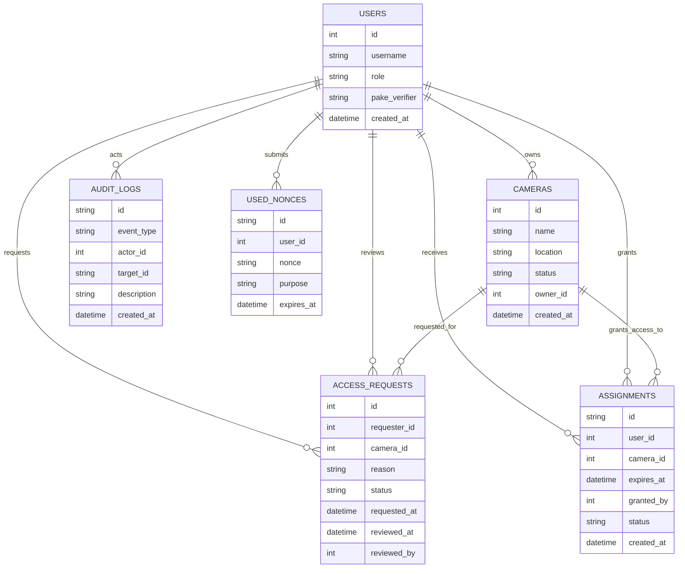
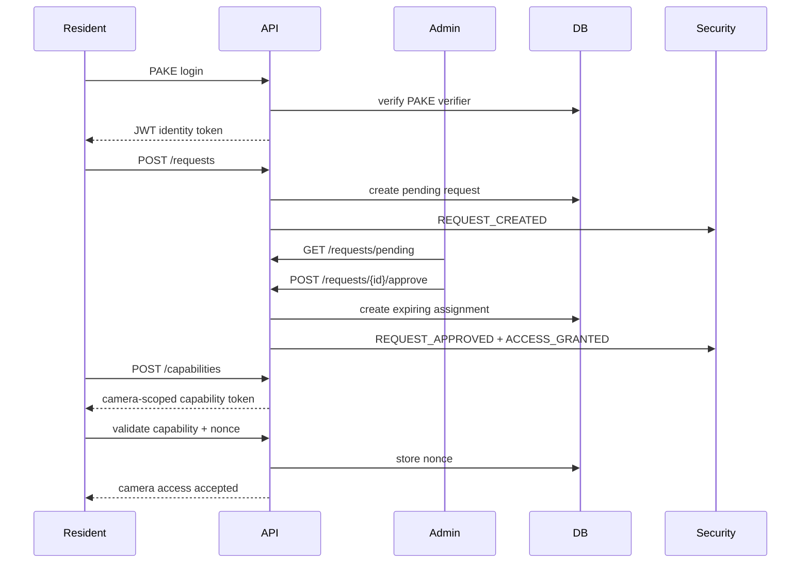
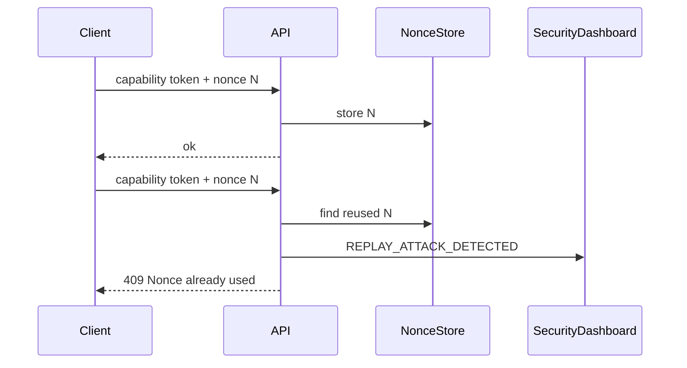
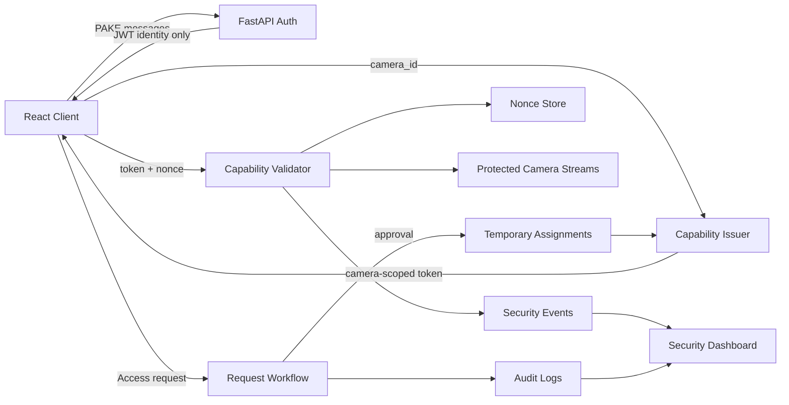

# Diagrams

## ER Diagram

```mermaid
erDiagram
  USERS ||--o{ CAMERAS : owns
  USERS ||--o{ ACCESS_REQUESTS : requests
  USERS ||--o{ ACCESS_REQUESTS : reviews
  USERS ||--o{ ASSIGNMENTS : receives
  USERS ||--o{ ASSIGNMENTS : grants
  USERS ||--o{ AUDIT_LOGS : acts
  USERS ||--o{ USED_NONCES : submits
  CAMERAS ||--o{ ACCESS_REQUESTS : requested_for
  CAMERAS ||--o{ ASSIGNMENTS : grants_access_to

  USERS {
    int id
    string username
    string role
    string pake_verifier
    datetime created_at
  }
  CAMERAS {
    int id
    string name
    string location
    string status
    int owner_id
    datetime created_at
  }
  ACCESS_REQUESTS {
    int id
    int requester_id
    int camera_id
    string reason
    string status
    datetime requested_at
    datetime reviewed_at
    int reviewed_by
  }
  ASSIGNMENTS {
    string id
    int user_id
    int camera_id
    datetime expires_at
    int granted_by
    string status
    datetime created_at
  }
  AUDIT_LOGS {
    string id
    string event_type
    int actor_id
    string target_id
    string description
    datetime created_at
  }
  USED_NONCES {
    string id
    int user_id
    string nonce
    string purpose
    datetime expires_at
  }
```

## Access Request Sequence

```mermaid
sequenceDiagram
  participant Resident
  participant API
  participant Admin
  participant DB
  participant Security

  Resident->>API: PAKE login
  API->>DB: verify PAKE verifier
  API-->>Resident: JWT identity token
  Resident->>API: POST /requests
  API->>DB: create pending request
  API->>Security: REQUEST_CREATED
  Admin->>API: GET /requests/pending
  Admin->>API: POST /requests/{id}/approve
  API->>DB: create expiring assignment
  API->>Security: REQUEST_APPROVED + ACCESS_GRANTED
  Resident->>API: POST /capabilities
  API-->>Resident: camera-scoped capability token
  Resident->>API: validate capability + nonce
  API->>DB: store nonce
  API-->>Resident: camera access accepted
```

## Replay Detection Sequence

```mermaid
sequenceDiagram
  participant Client
  participant API
  participant NonceStore
  participant SecurityDashboard

  Client->>API: capability token + nonce N
  API->>NonceStore: store N
  API-->>Client: ok
  Client->>API: capability token + nonce N
  API->>NonceStore: find reused N
  API->>SecurityDashboard: REPLAY_ATTACK_DETECTED
  API-->>Client: 409 Nonce already used
```

## Security Architecture

```mermaid
flowchart LR
  Browser["React Client"] -->|"PAKE messages"| Auth["FastAPI Auth"]
  Auth -->|"JWT identity only"| Browser
  Browser -->|"Access request"| Workflow["Request Workflow"]
  Workflow -->|"approval"| Assignments["Temporary Assignments"]
  Browser -->|"camera_id"| Capabilities["Capability Issuer"]
  Assignments --> Capabilities
  Capabilities -->|"camera-scoped token"| Browser
  Browser -->|"token + nonce"| Validator["Capability Validator"]
  Validator --> Nonces["Nonce Store"]
  Validator --> Streams["Protected Camera Streams"]
  Validator --> Events["Security Events"]
  Workflow --> Audit["Audit Logs"]
  Events --> Dashboard["Security Dashboard"]
  Audit --> Dashboard
```
