# Secure AI-Based Surveillance System with PAKE Authentication

## Master Project Documentation

| Field | Value |
| --- | --- |
| **Project Title** | Zero-Trust Smart Surveillance Access System using PAKE Authentication |
| **Course** | Network Programming and Security (NPS) |
| **Project Type** | Secure Surveillance / Zero-Trust Access Control |
| **Technology Stack** | FastAPI (Python), React + TypeScript + Vite, SQLite, SPAKE2 (PAKE), JWT |
| **Repository** | NPS — SecureCam / Zero-Trust Smart Surveillance System |

### Short Project Summary

This project implements a **zero-trust surveillance access platform** where logging in does **not** automatically grant camera access. Users authenticate with **Password-Authenticated Key Exchange (PAKE / SPAKE2)** so passwords are never sent in plaintext. A **JWT** proves identity only. **Camera-scoped capability tokens** plus **one-time nonce validation** are required before a resident, viewer, or security guard can view an assigned feed. Administrators approve **temporary assignments**, revoke access with audit trails, and monitor security through **audit logs** and a **security dashboard**. The system supports **admin local webcam**, **viewer local webcam**, and **IP MJPEG** camera sources using demo-grade frame polling (not production WebRTC).

---

## Table of Contents

1. [Abstract](#1-abstract)
2. [Introduction](#2-introduction)
3. [Problem Statement](#3-problem-statement)
4. [Objectives](#4-objectives)
5. [Scope](#5-scope)
6. [Existing System vs Proposed System](#6-existing-system-vs-proposed-system)
7. [High-Level System Architecture](#7-high-level-system-architecture)
8. [Folder Structure](#8-folder-structure)
9. [Database Design](#9-database-design)
10. [Authentication Design](#10-authentication-design)
11. [PAKE Bridge Implementation](#11-pake-bridge-implementation)
12. [JWT Design](#12-jwt-design)
13. [Authorization and RBAC Design](#13-authorization-and-rbac-design)
14. [Access Request Workflow](#14-access-request-workflow)
15. [Assignment Lifecycle](#15-assignment-lifecycle)
16. [Capability Token System](#16-capability-token-system)
17. [Nonce Replay Protection](#17-nonce-replay-protection)
18. [Camera Streaming / Frame Access](#18-camera-streaming--frame-access)
19. [Audit and Security Monitoring](#19-audit-and-security-monitoring)
20. [API Documentation](#20-api-documentation)
21. [End-to-End Workflow](#21-end-to-end-workflow)
22. [Threat Model](#22-threat-model)
23. [Testing and Verification](#23-testing-and-verification)
24. [Manual Demo Guide](#24-manual-demo-guide)
25. [Results and Outcomes](#25-results-and-outcomes)
26. [Limitations](#26-limitations)
27. [Future Scope](#27-future-scope)
28. [Conclusion](#28-conclusion)
29. [Related Documentation](#29-related-documentation)

---

## 1. Abstract

Modern surveillance systems collect sensitive video data that must be protected against unauthorized viewing, credential theft, and replay attacks. Traditional deployments often rely on a single login step after which users gain broad or permanent access to camera feeds. Passwords may be transmitted over the network, stored insecurely, or reused across services. Session tokens such as JWTs are frequently treated as authorization tokens, allowing any holder of a stolen token to access protected resources until expiry.

This project addresses these risks by implementing a **Zero-Trust Smart Surveillance Access System** grounded in Network Programming and Security (NPS) principles. Authentication uses **PAKE (SPAKE2)** so the client proves password knowledge without sending the password. Upon successful PAKE, the backend issues a **JWT** that establishes **identity and role only** — not camera authorization.

Camera access for limited roles (resident, viewer, security guard) requires:

1. An **admin-approved, time-bounded assignment** linking the user to specific cameras.
2. A **camera-scoped capability token** issued only when an active assignment exists.
3. **Nonce validation** that consumes a fresh, single-use nonce to prevent replay of prior authorization requests.

All significant actions — login success/failure, access requests, approvals, rejections, grants, revocations, expirations, unauthorized access attempts, and replay detection — are recorded in **audit logs** and **security events**. Administrators operate through a dedicated dashboard with live feeds, assignment management, and security telemetry.

The frontend provides role-specific dashboards (admin, resident/viewer, security guard), a premium landing page, PAKE login visualization, and capability-gated camera previews. The backend is a modular FastAPI application with centralized authorization helpers, pytest integration tests, and SQLite persistence suitable for academic demonstration.

This system demonstrates practical application of **secure authentication**, **least-privilege authorization**, **replay protection**, and **accountability** in a realistic surveillance use case.

---

## 2. Introduction

### 2.1 Background of Surveillance Systems

Video surveillance is widely deployed in residential complexes, campuses, retail environments, and industrial facilities. Cameras generate continuous streams of visual data that may include private spaces, identifiable individuals, and security-sensitive activity. Network-connected IP cameras, browser-based webcams, and mobile device cameras have made surveillance more accessible but also expanded the attack surface.

### 2.2 Why Normal Login-Based Surveillance Is Risky

A typical surveillance portal might:

- Accept a username and password over HTTPS (or worse, HTTP).
- Issue a session cookie or JWT after password verification.
- Grant access to **all** cameras the user is loosely associated with.

This model has several weaknesses:

| Risk | Description |
| --- | --- |
| **Credential exposure** | Passwords sent to the server can be logged, intercepted on misconfigured TLS, or exposed via phishing. |
| **Over-privileged sessions** | A login token often implies blanket authorization. |
| **Long-lived access** | Users retain access until manual revocation or token expiry. |
| **Weak accountability** | Without structured audit trails, administrators cannot reconstruct who viewed which feed and when. |
| **Token misuse** | Stolen JWTs can be replayed to access APIs if those APIs trust identity tokens as authorization. |

### 2.3 Why Zero-Trust Is Needed

Zero-trust security assumes **no implicit trust** based on network location or prior authentication alone. Every sensitive action requires explicit, scoped authorization. In this project:

- **Identity ≠ Authorization** — JWT proves who you are; capability tokens prove what you may do.
- **Least privilege** — Users see only owned or assigned cameras.
- **Time bounds** — Assignments expire automatically.
- **Explicit approval** — Residents/guards request access; admins approve.
- **Verifiable usage** — Nonce consumption prevents replay of authorization handshakes.

### 2.4 Importance of PAKE

Password-Authenticated Key Exchange allows two parties to establish a shared secret or confirm password knowledge **without transmitting the password**. SPAKE2 (used here via a Node.js bridge) mitigates offline dictionary attacks when combined with salted verifiers and reduces exposure during login. This directly supports NPS learning outcomes around **secure authentication protocols**.

### 2.5 Importance of Audit Logs

Audit logs provide a **durable, queryable history** of administrative and user actions. They support forensic investigation, compliance demonstration, and viva explanations of accountability. This project maintains separate **audit logs** (actor/target oriented) and **security events** (severity/category oriented) for layered monitoring.

### 2.6 Importance of Temporary Access

Surveillance access is often needed for **incident investigation** (e.g., a stolen bicycle) rather than permanent monitoring. Temporary assignments:

- Limit exposure window.
- Force periodic re-approval.
- Align with privacy expectations in residential settings.

---

## 3. Problem Statement

Existing surveillance and VMS (Video Management System) deployments frequently exhibit the following problems:

1. **Permanent or broad access after login** — Once authenticated, users may access many or all feeds without per-camera authorization.
2. **Insecure password handling** — Passwords may be sent in plaintext (on insecure channels), stored reversibly, or verified without modern hashing.
3. **JWT/session misuse** — Identity tokens are accepted as authorization for sensitive resources, violating least privilege.
4. **Unauthorized feed access** — Users without explicit grants may reach camera frame/stream endpoints if RBAC is coarse.
5. **Replay attacks** — Captured authorization requests or tokens may be reused to regain access.
6. **Weak admin accountability** — Approvals, revocations, and configuration changes may leave no durable audit trail.
7. **Inadequate role separation** — Guards, residents, and administrators may share undifferentiated permissions.
8. **No camera-scoped credentials** — Tokens are global rather than bound to a specific camera and assignment.

**Required solution characteristics:**

- PAKE-based login without plaintext password transmission.
- JWT for identity only.
- Admin-approved, expiring, camera-specific assignments.
- Capability tokens scoped to user, camera, assignment, and permission.
- Nonce-based replay protection on capability validation.
- Comprehensive audit and security event logging.
- Role-specific dashboards with enforced backend checks.

---

## 4. Objectives

### 4.1 Primary Objectives

| # | Objective | Implementation Status |
| --- | --- | --- |
| 1 | Implement PAKE-based secure authentication (SPAKE2) | ✅ Implemented |
| 2 | Implement zero-trust camera access control | ✅ Implemented |
| 3 | Implement admin-approved temporary assignments | ✅ Implemented |
| 4 | Implement camera-scoped capability tokens | ✅ Implemented |
| 5 | Implement nonce replay protection | ✅ Implemented |
| 6 | Implement audit logging and security dashboard | ✅ Implemented |

### 4.2 Secondary Objectives

| # | Objective | Implementation Status |
| --- | --- | --- |
| 1 | Provide role-specific dashboards (admin, resident, viewer, guard) | ✅ Implemented |
| 2 | Support local webcam and IP MJPEG cameras | ✅ Implemented |
| 3 | Provide security telemetry (events, metrics) | ✅ Implemented |
| 4 | Prototype AI/security analytics demo panel | ⚠️ Planned earlier; **not in current frontend routes** |
| 5 | Maintain testable FastAPI/React architecture | ✅ Implemented (24 backend tests) |

---

## 5. Scope

### 5.1 Implemented Scope (Current System)

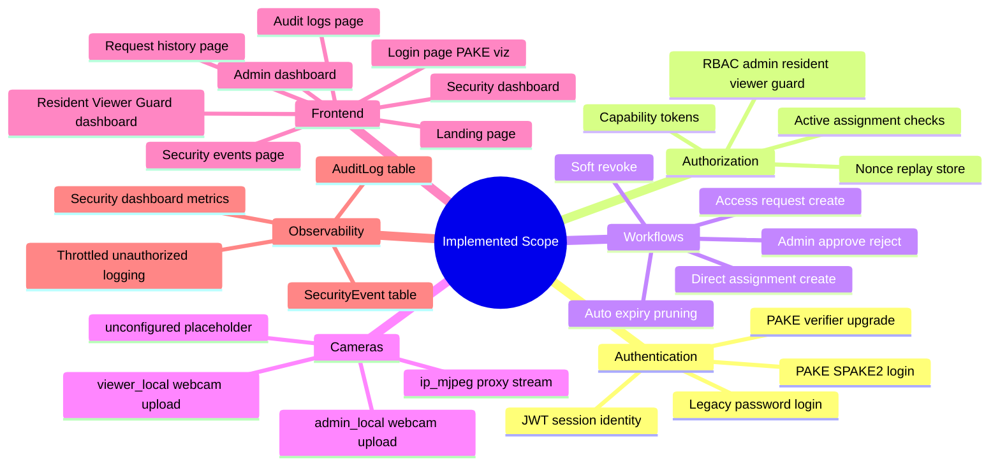

**Detailed implemented features:**

- **PAKE login** — `POST /api/v1/auth/pake/start` and `POST /api/v1/auth/pake/finish`
- **Legacy login** — `POST /api/v1/auth/login` (Argon2id verification, compatibility)
- **JWT identity** — `GET /api/v1/auth/me`
- **Roles** — `admin`, `resident`, `security_guard`, `viewer` (viewer treated as resident-equivalent in RBAC)
- **Camera request/approval** — Residents/guards/viewers submit requests; admin approves with duration
- **Assignments** — Time-bounded grants with `active`, `expired`, `revoked` status
- **Capability tokens** — Issue and validate with `VIEW` permission
- **Nonce replay detection** — `UsedNonce` table; `409` on reuse; `REPLAY_ATTACK_DETECTED` logged
- **Audit logs** — `GET /api/v1/audit-logs`
- **Security dashboard** — `GET /api/v1/security-dashboard`
- **Security events** — `GET /api/v1/security-events` and alias `GET /api/v1/security/events`
- **Admin local webcam** — Browser capture → JPEG upload → frame polling
- **IP MJPEG** — Backend stream proxy with capability query parameter for limited roles
- **Frontend dashboards** — Responsive camera grids, capability-gated viewer previews

### 5.2 Out of Scope / Future Work

| Item | Reason |
| --- | --- |
| True WebRTC end-to-end encrypted video | Current demo uses JPEG frame polling and MJPEG proxy |
| Real ML object/motion detection | No trained model integrated; analytics panel not routed |
| Production deployment (TLS, secrets, scaling) | Academic/local SQLite demo |
| Mobile native app | Web-only React frontend |
| Enterprise multi-tenant scaling | Single-tenant SQLite design |
| Hardware security module (HSM) signing | Capability JWT signed with app secret |
| Federated identity (OAuth/SAML) | Username + PAKE only |

---

## 6. Existing System vs Proposed System

| Dimension | Existing / Naive Surveillance Portal | Proposed Zero-Trust System (This Project) |
| --- | --- | --- |
| **Login** | Plain password POST | PAKE (SPAKE2) — password not sent directly |
| **Session token** | JWT grants feed access | JWT proves **identity only** |
| **Camera authorization** | Implicit after login | Explicit **capability token** per camera |
| **Replay protection** | None | **One-time nonce** on capability validation |
| **Access duration** | Permanent or manual | **Temporary assignments** with expiry |
| **Approval workflow** | None / informal | **Access request → admin approve/reject** |
| **Revocation** | Delete user or rotate password | **Soft revoke** assignment + audit trail |
| **Audit trail** | Minimal or absent | **AuditLog** + **SecurityEvent** tables |
| **Role separation** | Weak | **admin / resident / viewer / security_guard** with backend enforcement |
| **Unauthorized access handling** | Generic 403 | Throttled `UNAUTHORIZED_CAMERA_ACCESS` security events |
| **Camera sources** | Single type | `admin_local`, `viewer_local`, `ip_mjpeg`, `unconfigured` |
| **Streaming** | Direct RTSP/WebRTC (ideal) | Demo **frame polling** + MJPEG proxy |

---

## 7. High-Level System Architecture

### 7.1 Component Overview

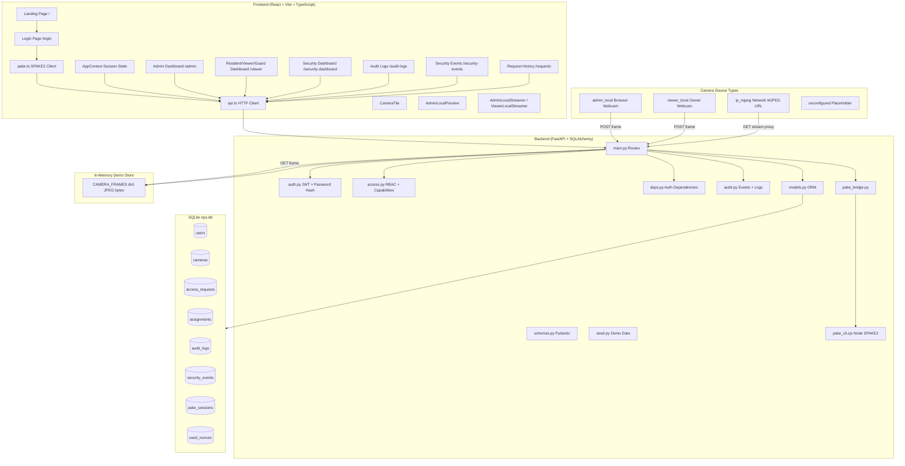

### 7.2 Request Path Layers

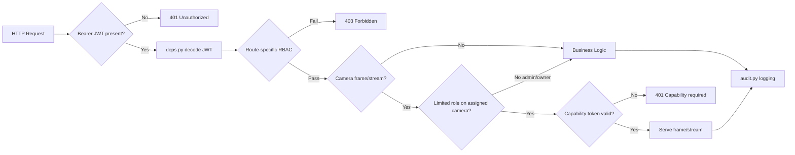

### 7.3 Frontend Route Map

| Route | Page | Roles |
| --- | --- | --- |
| `/` | LandingPage | Public |
| `/login` | LoginPage (wraps Login.tsx) | Public |
| `/admin` | AdminDashboard | admin |
| `/viewer` | ViewerDashboard | resident, viewer, security_guard |
| `/security-dashboard` | SecurityDashboard | admin |
| `/audit-logs` | AuditLogs | admin |
| `/security-events` | SecurityEvents | admin |
| `/requests` | RequestHistory | resident, viewer, security_guard |

> **Note:** A prototype AI analytics demo page was considered during development but is **not present** in the current `App.tsx` routing.

---

## 8. Folder Structure

### 8.1 Repository Layout

```
NPS/
├── Frontend/                    # React + Vite + TypeScript UI
│   ├── src/
│   │   ├── pages/               # Route-level screens
│   │   ├── components/          # Reusable UI + surveillance widgets
│   │   ├── lib/                 # API client, PAKE client, utilities
│   │   ├── context/             # AppContext global state
│   │   └── hooks/               # UI hooks
│   ├── public/                  # Static assets (favicon, etc.)
│   └── index.html               # App shell + branding meta
├── backend/
│   ├── app/                     # FastAPI application package
│   │   ├── main.py              # Routes, frame store, orchestration
│   │   ├── auth.py              # Password hash, JWT, capability JWT
│   │   ├── access.py            # RBAC, assignments, capabilities, nonces
│   │   ├── deps.py              # FastAPI auth dependencies
│   │   ├── audit.py             # Security events, audit logs, expiry
│   │   ├── models.py            # SQLAlchemy ORM models
│   │   ├── schemas.py           # Pydantic request/response models
│   │   ├── seed.py              # Demo users, cameras, assignments
│   │   ├── pake_bridge.py       # Python → Node SPAKE2 bridge
│   │   ├── config.py            # Settings (JWT secret, PAKE params)
│   │   └── database.py          # Engine, session, schema migrations
│   ├── pake_cli.cjs             # Node SPAKE2 CLI (verifier/start/finish)
│   ├── tests/                   # pytest integration tests
│   └── nps.db                   # SQLite database (generated at runtime)
└── docs/                        # Project documentation
    ├── MASTER_DOCUMENTATION.md  # This document
    ├── API.md                   # Endpoint reference
    ├── ARCHITECTURE.md          # Architecture notes
    ├── THREAT_MODEL.md          # Threat analysis
    └── DIAGRAMS.md              # Supplementary diagrams
```

### 8.2 Key Backend Files

| File | Responsibility |
| --- | --- |
| `main.py` | All HTTP routes; in-memory `CAMERA_FRAMES`; wires auth, access, audit |
| `access.py` | Limited roles, assignment checks, capability issue/validate helpers, nonce store |
| `auth.py` | Argon2id password hashing, JWT creation, capability JWT encode/decode |
| `deps.py` | `get_current_user`, `require_admin`, bearer token extraction |
| `audit.py` | `log_event`, `write_audit_log`, assignment expiry pruning, throttled unauthorized logging |
| `models.py` | SQLAlchemy models for all tables |
| `schemas.py` | Pydantic DTOs for API contracts |
| `seed.py` | Idempotent demo seed (users, cameras, sample assignment) |
| `pake_bridge.py` | Subprocess calls to `pake_cli.cjs` for SPAKE2 operations |
| `pake_cli.cjs` | Node implementation using `spake2` package |

### 8.3 Key Frontend Files

| File | Responsibility |
| --- | --- |
| `lib/api.ts` | Typed HTTP client; auth token storage; capability stream URLs |
| `lib/pake.ts` | Browser-side SPAKE2 handshake client |
| `pages/Login.tsx` | PAKE login UI with step visualization |
| `pages/AdminDashboard.tsx` | Camera list, live feed grid, assignments, user management |
| `pages/ViewerDashboard.tsx` | Owned cameras, assigned cameras, capability issue/validate flow |
| `components/CameraTile.tsx` | Surveillance-style camera card with preview viewport |
| `components/AdminLocalPreview.tsx` | Polls `/frame` endpoint; stops on 401/403 |
| `components/AdminLocalStreamer.tsx` | Captures admin webcam frames and uploads |
| `components/ViewerLocalStreamer.tsx` | Captures viewer-owned webcam frames |
| `context/AppContext.tsx` | Session, dashboards data, assignments, refresh |

---

## 9. Database Design

### 9.1 Entity-Relationship Diagram

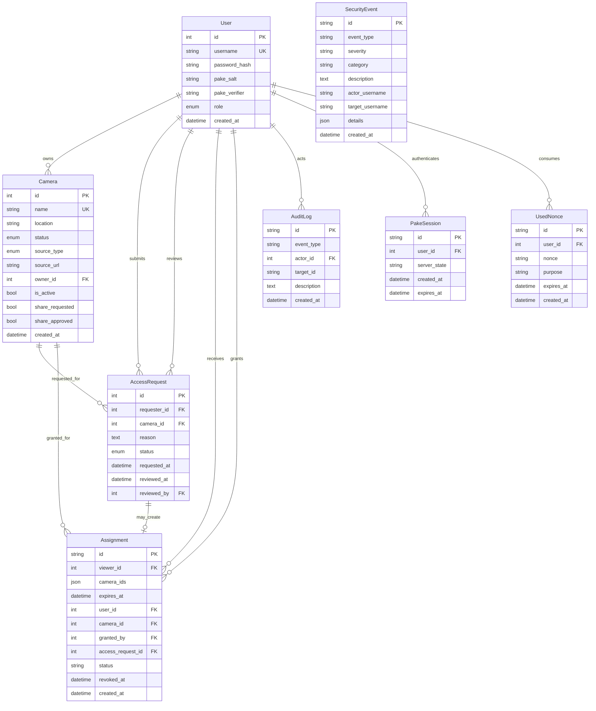

### 9.2 Table Descriptions

#### `users`

Stores all accounts with role and credential material.

| Field | Type | Description |
| --- | --- | --- |
| `id` | Integer PK | Auto-increment user ID |
| `username` | String(100) UK | Unique login name |
| `password_hash` | String(255) | Argon2id hash (legacy PBKDF2 supported for verification) |
| `pake_salt` | String nullable | SPAKE2 salt (base64url) |
| `pake_verifier` | String nullable | SPAKE2 password verifier |
| `role` | Enum | `admin`, `resident`, `security_guard`, `viewer` |
| `created_at` | DateTime | Account creation timestamp |

#### `cameras`

| Field | Type | Description |
| --- | --- | --- |
| `id` | Integer PK | Camera ID |
| `name` | String(120) UK | Display name |
| `location` | String(160) | Location label |
| `status` | Enum | `online` / `offline` |
| `source_type` | Enum | `unconfigured`, `ip_mjpeg`, `admin_local`, `viewer_local` |
| `source_url` | String nullable | MJPEG URL when `source_type = ip_mjpeg` |
| `owner_id` | FK nullable | `null` = admin-managed; otherwise viewer/resident owner |
| `is_active` | Boolean | Admin can disable camera |
| `share_requested` | Boolean | Owner requested admin share approval |
| `share_approved` | Boolean | Admin approved sharing viewer camera |
| `created_at` | DateTime | Creation timestamp |

#### `access_requests`

| Field | Type | Description |
| --- | --- | --- |
| `id` | Integer PK | Request ID |
| `requester_id` | FK | User who submitted request |
| `camera_id` | FK | Target admin camera |
| `reason` | Text | Justification (incident description) |
| `status` | Enum | `pending`, `approved`, `rejected` |
| `requested_at` | DateTime | Submission time |
| `reviewed_at` | DateTime nullable | Admin review time |
| `reviewed_by` | FK nullable | Admin user ID |

#### `assignments`

| Field | Type | Description |
| --- | --- | --- |
| `id` | String(36) PK | UUID assignment ID |
| `viewer_id` | FK | Grantee (resident/viewer/guard) |
| `camera_ids` | JSON | List of camera IDs (multi-camera grant) |
| `expires_at` | DateTime | Expiry timestamp (UTC stored naive) |
| `user_id` | FK nullable | Redundant grantee reference for compatibility |
| `camera_id` | FK nullable | Single-camera reference for compatibility |
| `granted_by` | FK nullable | Admin who granted |
| `access_request_id` | FK nullable | Originating request if applicable |
| `status` | String | `active`, `expired`, `revoked` |
| `revoked_at` | DateTime nullable | Soft revoke timestamp |
| `created_at` | DateTime | Creation timestamp |

#### `audit_logs`

| Field | Type | Description |
| --- | --- | --- |
| `id` | String(36) PK | UUID |
| `event_type` | String(64) | e.g. `ACCESS_GRANTED`, `REQUEST_APPROVED` |
| `actor_id` | FK nullable | Acting user (null for system) |
| `target_id` | String nullable | Assignment, camera, or entity ID |
| `description` | Text | Human-readable detail |
| `created_at` | DateTime | Event time |

#### `security_events`

| Field | Type | Description |
| --- | --- | --- |
| `id` | String(36) PK | UUID |
| `event_type` | String(64) | Security classification |
| `severity` | String(24) | `low`, `medium`, `high` |
| `category` | String(64) | e.g. `authorization`, `authentication` |
| `description` | Text | Summary |
| `actor_username` | String nullable | Actor username |
| `target_username` | String nullable | Target username |
| `details` | JSON | Structured metadata (camera_id, assignment_id, etc.) |
| `created_at` | DateTime | Event time |

#### `pake_sessions`

| Field | Type | Description |
| --- | --- | --- |
| `id` | String(36) PK | Session UUID returned to client |
| `user_id` | FK | Authenticating user |
| `server_state` | String(4096) | Serialized SPAKE2 server state |
| `created_at` | DateTime | Start time |
| `expires_at` | DateTime | Short-lived; incomplete handshakes expire |

#### `used_nonces`

| Field | Type | Description |
| --- | --- | --- |
| `id` | String(36) PK | UUID |
| `user_id` | FK | User who consumed nonce |
| `nonce` | String(128) | Client-provided nonce |
| `purpose` | String(64) | Default `capability` |
| `expires_at` | DateTime | Nonce record TTL |
| `created_at` | DateTime | Storage time |

---

## 10. Authentication Design

### 10.1 Dual Login Paths

| Path | Endpoint | Purpose |
| --- | --- | --- |
| **PAKE (primary)** | `POST /api/v1/auth/pake/start`, `POST /api/v1/auth/pake/finish` | Secure login for demo and production intent |
| **Legacy** | `POST /api/v1/auth/login` | Compatibility, tests, fallback |
| **PAKE upgrade** | `POST /api/v1/auth/pake/upgrade` | Generate PAKE salt/verifier for existing user |

During **PAKE login**, the password is **not sent directly** to the server in the finish step. Instead, the client and server exchange SPAKE2 messages derived from a **verifier** stored in `users.pake_verifier` and `users.pake_salt`.

### 10.2 PAKE Sequence Diagram

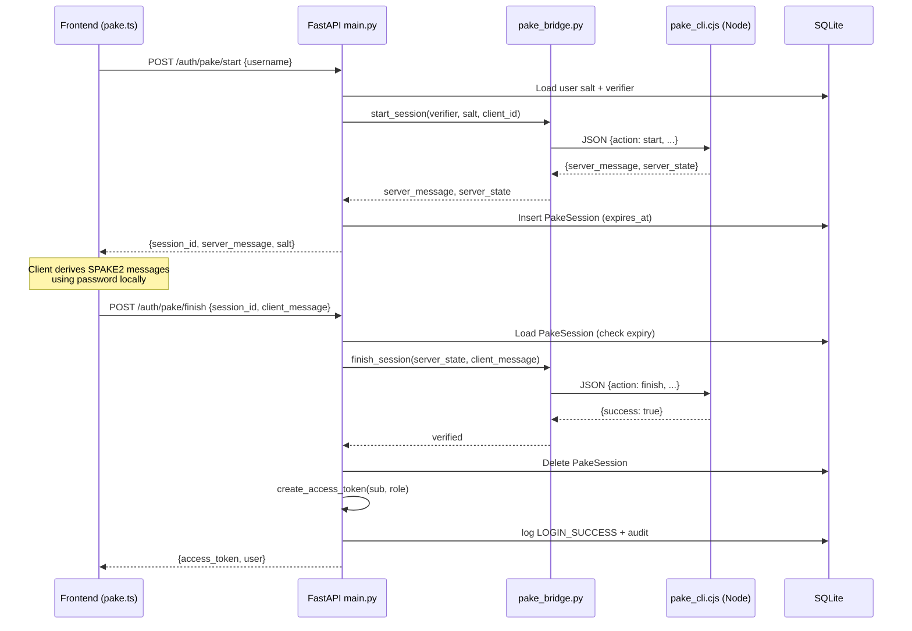

### 10.3 Password Storage

- **Legacy path:** Argon2id `password_hash` for direct verification.
- **PAKE path:** `pake_salt` + `pake_verifier` for SPAKE2 handshake.
- Seed script generates **both** for demo users.

---

## 11. PAKE Bridge Implementation

### 11.1 Why a Bridge?

SPAKE2 is invoked through a **Node.js CLI** (`pake_cli.cjs`) using the `spake2` npm package. Python calls this via `subprocess` in `pake_bridge.py`. This design:

- Reuses a mature SPAKE2 implementation.
- Keeps FastAPI code focused on HTTP and policy.
- Allows independent testing of the CLI.

### 11.2 Bridge Flow

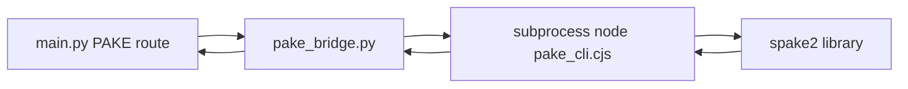

### 11.3 CLI Actions

| Action | Input | Output |
| --- | --- | --- |
| `verifier` | password, salt, client_id | verifier string (stored in DB) |
| `start` | verifier, salt, client_id | server_message, server_state |
| `finish` | server_state, client_message | success boolean |

### 11.4 Session Expiry

`PakeSession` rows have `expires_at`. If the client does not complete `/pake/finish` in time, the session is rejected with **401 Session expired**. This limits exposure of partial handshake state.

---

## 12. JWT Design

### 12.1 Access Token Payload

```json
{
  "sub": "3",
  "role": "resident",
  "iat": 1710000000,
  "exp": 1710003600
}
```

| Claim | Meaning |
| --- | --- |
| `sub` | User ID (string) |
| `role` | `admin`, `resident`, `security_guard`, or `viewer` |
| `iat` | Issued-at epoch seconds |
| `exp` | Expiry epoch seconds |

### 12.2 Zero-Trust Principle

> **JWT proves identity. It does NOT authorize camera viewing for assigned third-party feeds.**

Limited roles accessing **assigned** admin cameras must additionally present a **capability token** on frame/stream endpoints. This separation is the architectural core of the project.

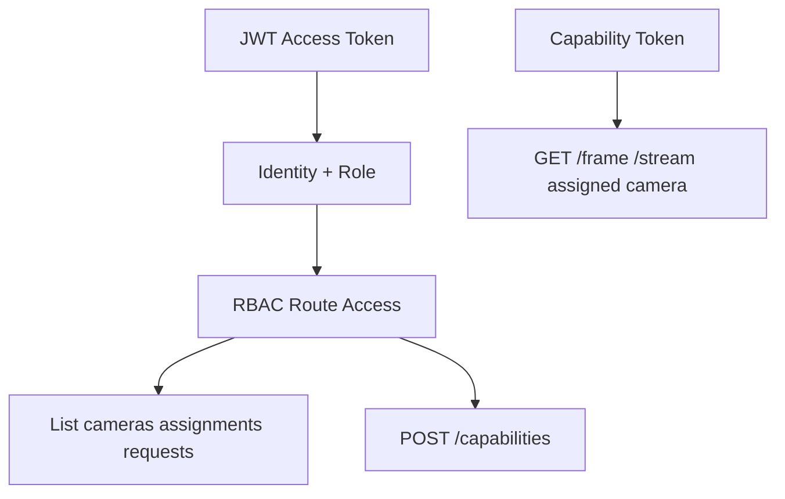

---

## 13. Authorization and RBAC Design

### 13.1 Roles

| Role | Description | Camera Visibility |
| --- | --- | --- |
| `admin` | Full system control | All cameras; configures sources; approves requests |
| `resident` | Residential user | Owned cameras + actively assigned cameras |
| `viewer` | Legacy alias | Treated same as `resident` in `access.py` |
| `security_guard` | Guard account | Only actively assigned cameras (no owner cameras by default) |

### 13.2 Centralized Helpers (`access.py`)

| Function | Purpose |
| --- | --- |
| `is_limited_role()` | resident, viewer, security_guard |
| `user_can_access_camera()` | Admin, owner, or active assignment |
| `user_requires_capability_for_camera()` | True for limited roles on non-owned cameras |
| `user_has_active_assignment()` | Returns assignment if valid |
| `issue_capability_for_user()` | Creates scoped capability JWT |
| `validate_capability_payload()` | Verifies token matches user, camera, assignment |
| `enforce_camera_access()` | Frame/stream gate with optional capability |
| `store_nonce()` / `nonce_already_used()` | Replay protection |

### 13.3 Guard With No Assignment

A security guard (`guard_a`) with **no active assignment** sees the **No Active Camera Access** empty state in `ViewerDashboard.tsx`. Backend returns empty assigned camera lists and denies frame access with 403.

### 13.4 Admin Privileges

- Create/revoke assignments directly.
- Approve/reject access requests.
- Configure admin cameras (`admin_local`, `ip_mjpeg`).
- Upload admin webcam frames.
- View all audit logs and security dashboard.

---

## 14. Access Request Workflow

### 14.1 Sequence Diagram

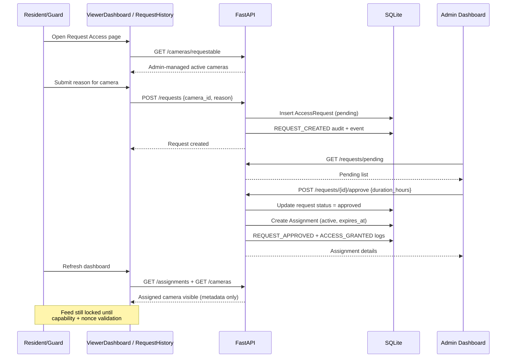

### 14.2 Request States

| Status | Meaning |
| --- | --- |
| `pending` | Awaiting admin review |
| `approved` | Admin approved; assignment created |
| `rejected` | Admin denied; no assignment |

---

## 15. Assignment Lifecycle

### 15.1 State Diagram

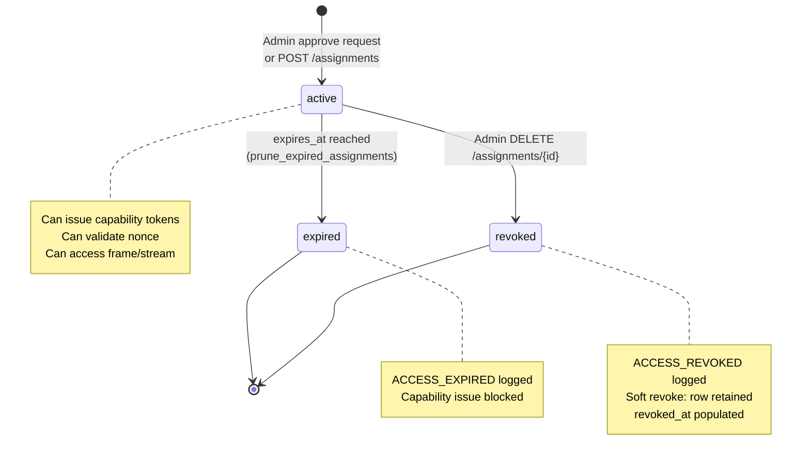

### 15.2 Soft Revoke

Revocation **does not delete** the assignment row. Instead:

- `status` → `revoked`
- `revoked_at` → current timestamp
- Security event `ACCESS_REVOKED` + audit log written

This preserves history for the security dashboard and academic audit demonstration.

### 15.3 Expiry Pruning

`audit.prune_expired_assignments()` runs during relevant API calls. Active assignments past `expires_at` transition to `expired` with `ACCESS_EXPIRED` events.

---

## 16. Capability Token System

### 16.1 Why Capability Tokens?

| Problem | Capability Solution |
| --- | --- |
| JWT is global | Capability is **per camera** |
| JWT lives long | Capability expiry tied to **assignment** (max 15 min for assigned) |
| JWT has no permission granularity | Capability lists permissions (e.g. `VIEW`) |
| Stolen JWT exposes all APIs | Stolen capability exposes **one camera** for shorter window |

### 16.2 JWT vs Capability Token

| Aspect | JWT Access Token | Capability Token |
| --- | --- | --- |
| **Purpose** | Identity + role | Camera action authorization |
| **Typ** claim | (default JWT) | `capability` |
| **Scope** | Global session | Single `camera_id` |
| **Assignment binding** | None | `assignment_id` embedded |
| **Permissions** | None | e.g. `["VIEW"]` |
| **Issued when** | Login success | `POST /capabilities` with active assignment |
| **Required for** | All authenticated routes | Frame/stream on assigned cameras (limited roles) |
| **Replay protection** | None (by design) | Requires fresh nonce at validation |

### 16.3 Capability JWT Payload (conceptual)

```json
{
  "typ": "capability",
  "sub": "3",
  "camera_id": 1,
  "assignment_id": "uuid-here",
  "permissions": ["VIEW"],
  "exp": 1710000900
}
```

### 16.4 API Routes

| Route | Method | Description |
| --- | --- | --- |
| `/api/v1/capabilities` | POST | Issue capability token for `camera_id` |
| `/api/v1/capabilities/validate` | POST | Validate token + consume nonce |

### 16.5 Zero-Trust Unlock Flow

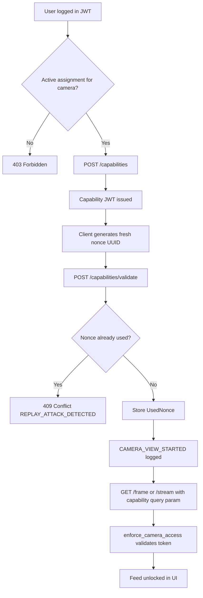

---

## 17. Nonce Replay Protection

### 17.1 Design

Every successful capability validation requires a **fresh nonce** (client-generated UUID). The server:

1. Checks `used_nonces` for `(user_id, nonce)`.
2. If found → **409 Conflict** + `REPLAY_ATTACK_DETECTED` security event.
3. If not found → stores nonce with expiry + proceeds.

### 17.2 Replay Attack Sequence

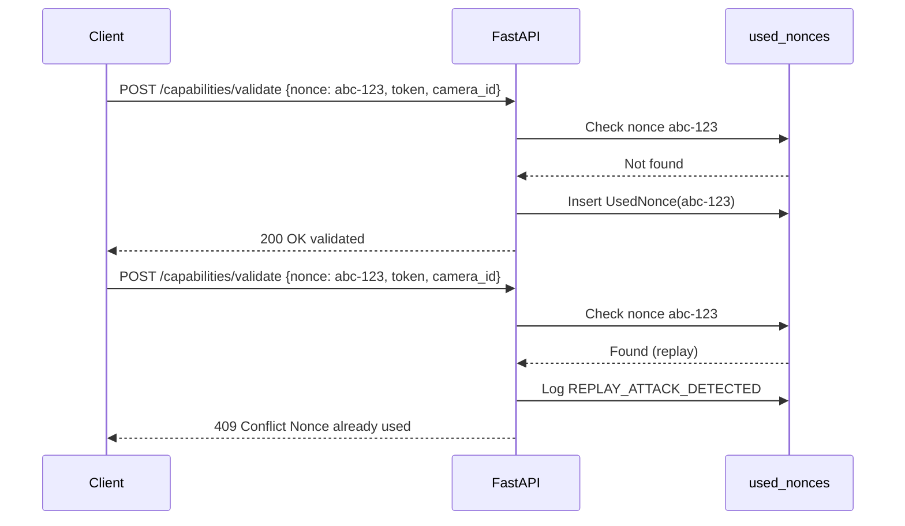

### 17.3 Manual Verification

This behavior has been manually verified during demo preparation:

1. Expand assigned camera → first nonce validates successfully.
2. Replay same nonce via DevTools or scripted request → **409** response.
3. `REPLAY_ATTACK_DETECTED` appears in **Security Events** page.

---

## 18. Camera Streaming / Frame Access

### 18.1 Source Types

| `source_type` | Description | Data Path |
| --- | --- | --- |
| `unconfigured` | Admin has not set source | Placeholder UI; no feed |
| `admin_local` | Admin browser webcam | JS capture → `POST /admin/cameras/{id}/frame` → in-memory store |
| `viewer_local` | Resident/viewer browser webcam | Owner `POST /cameras/{id}/frame` |
| `ip_mjpeg` | Network MJPEG camera | `GET /cameras/{id}/stream` proxies `source_url` |

### 18.2 Demo Streaming Architecture

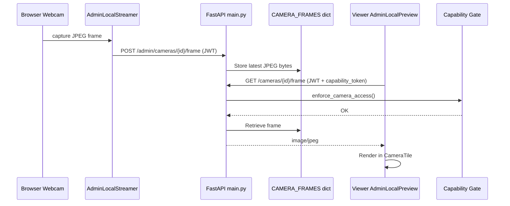

### 18.3 MJPEG Proxy

For `ip_mjpeg`, the backend proxies the configured `source_url`. Limited roles append `capability_token` as a query parameter because HTML `` cannot set Authorization headers.

### 18.4 Honest Implementation Note

This is **demo-grade streaming**:

- Frames are stored in an **in-memory Python dict** (`CAMERA_FRAMES`), not durable storage.
- Polling interval is ~500ms in `AdminLocalPreview.tsx`.
- **Not WebRTC**, not end-to-end encrypted video transport.

---

## 19. Audit and Security Monitoring

### 19.1 AuditLog vs SecurityEvent

| Store | Orientation | Typical Use |
| --- | --- | --- |
| **AuditLog** | Actor ID + target ID + description | Compliance trail, admin audit page |
| **SecurityEvent** | Severity + category + usernames + JSON details | Security dashboard, alerts |

Both are written for important actions via `write_audit_log()` and `log_event()`.

### 19.2 Implemented Event Types

| Event Type | Typical Trigger |
| --- | --- |
| `LOGIN_SUCCESS` | Successful login or PAKE finish |
| `LOGIN_FAILURE` | Bad password, wrong role, expired PAKE session |
| `REQUEST_CREATED` | Resident submits access request |
| `REQUEST_APPROVED` | Admin approves request |
| `REQUEST_REJECTED` | Admin rejects request |
| `ACCESS_GRANTED` | Assignment created |
| `ACCESS_REVOKED` | Admin revokes assignment |
| `ACCESS_EXPIRED` | Assignment passed `expires_at` |
| `CAMERA_VIEW_STARTED` | Successful capability validation |
| `REPLAY_ATTACK_DETECTED` | Duplicate nonce on validate |
| `UNAUTHORIZED_CAMERA_ACCESS` | Frame/stream access denied (throttled per user+camera, 45s) |

### 19.3 Security Dashboard Metrics

`GET /api/v1/security-dashboard` returns:

- `authentication_success_count`
- `authentication_failure_count`
- `pending_requests`
- `approved_requests`
- `rejected_requests`
- `expired_assignments`
- `revoked_assignments`
- `recent_security_events`
- `recent_audit_logs`

### 19.4 Monitoring Flow

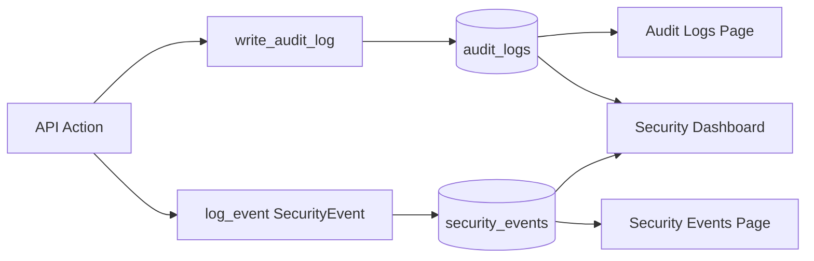

---

## 20. API Documentation

Full details: [API.md](API.md). Summary below.

### 20.1 Auth

| Method | Endpoint | Description |
| --- | --- | --- |
| POST | `/api/v1/auth/login` | Legacy username/password login |
| POST | `/api/v1/auth/pake/start` | Begin SPAKE2 handshake |
| POST | `/api/v1/auth/pake/finish` | Complete SPAKE2 handshake → JWT |
| POST | `/api/v1/auth/pake/upgrade` | Generate PAKE verifier for user |
| GET | `/api/v1/auth/me` | Current user profile |

### 20.2 Cameras

| Method | Endpoint | Description |
| --- | --- | --- |
| GET | `/api/v1/cameras` | List accessible cameras (role-filtered) |
| GET | `/api/v1/cameras/requestable` | List admin cameras available to request |
| POST | `/api/v1/cameras` | Create viewer-owned camera |
| PUT | `/api/v1/cameras/{id}` | Update viewer-owned camera |
| POST | `/api/v1/cameras/{id}/share-request` | Request admin share approval |
| GET | `/api/v1/cameras/{id}/frame` | Get latest JPEG frame |
| GET | `/api/v1/cameras/{id}/stream` | Proxy MJPEG stream |
| POST | `/api/v1/cameras/{id}/frame` | Upload viewer local frame |
| PUT | `/api/v1/admin/cameras/{id}` | Configure admin camera source |
| PUT | `/api/v1/admin/cameras/{id}/access` | Enable/disable, share approval |
| GET | `/api/v1/admin/cameras/{id}/probe` | Test MJPEG URL reachability |
| POST | `/api/v1/admin/cameras/{id}/frame` | Upload admin local frame |

### 20.3 Requests

| Method | Endpoint | Description |
| --- | --- | --- |
| POST | `/api/v1/requests` | Create access request |
| GET | `/api/v1/requests/my` | User's own requests |
| GET | `/api/v1/requests/pending` | Admin pending queue |
| POST | `/api/v1/requests/{id}/approve` | Approve → create assignment |
| POST | `/api/v1/requests/{id}/reject` | Reject request |

### 20.4 Assignments

| Method | Endpoint | Description |
| --- | --- | --- |
| GET | `/api/v1/assignments` | List own (or all for admin) |
| POST | `/api/v1/assignments` | Admin create assignment |
| DELETE | `/api/v1/assignments/{id}` | Admin soft-revoke |

### 20.5 Capabilities

| Method | Endpoint | Description |
| --- | --- | --- |
| POST | `/api/v1/capabilities` | Issue camera capability token |
| POST | `/api/v1/capabilities/validate` | Validate token + consume nonce |

### 20.6 Audit / Security

| Method | Endpoint | Description |
| --- | --- | --- |
| GET | `/api/v1/audit-logs` | Admin audit history |
| GET | `/api/v1/security-events` | Security events list |
| GET | `/api/v1/security/events` | Alias for security events |
| GET | `/api/v1/security-dashboard` | Aggregated security metrics |

### 20.7 Admin Users

| Method | Endpoint | Description |
| --- | --- | --- |
| GET | `/api/v1/admin/users` | List users (optional role filter) |
| POST | `/api/v1/admin/users` | Create user |

---

## 21. End-to-End Workflow

### 21.1 Complete Zero-Trust Sequence

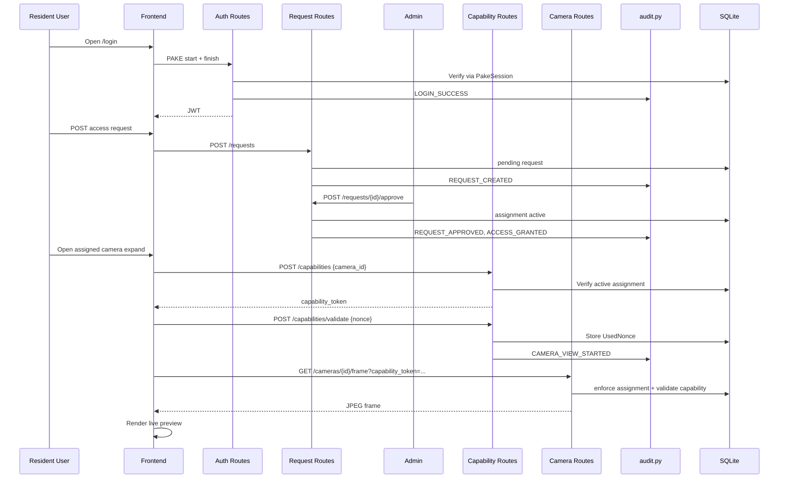

---

## 22. Threat Model

| Threat | Description | Mitigation (Implemented) |
| --- | --- | --- |
| **Password interception** | Attacker captures password on login | PAKE (SPAKE2) — password not transmitted |
| **Credential leakage (DB)** | Database breach exposes passwords | Argon2id hash + PAKE verifier only |
| **JWT theft** | Stolen bearer token | Short expiry; JWT does **not** grant assigned camera access alone |
| **Unauthorized camera access** | User views unassigned feed | RBAC in `access.py`; `enforce_camera_access`; 401/403 |
| **Replay attack** | Reuse captured validate request | `UsedNonce` store; 409 + `REPLAY_ATTACK_DETECTED` |
| **Stale assignment** | Access after expiry | `expires_at` check; prune to `expired`; capability blocked |
| **Silent admin action** | Admin grants/revokes without trace | `write_audit_log` + `log_event` on all admin actions |
| **Excessive permissions** | User gets global video access | Capability scoped to one camera + `VIEW` permission |
| **Revoked user retries feed** | Continued polling after revoke | Assignment `revoked`; capability invalid; 401/403 stops frontend polling |
| **Unauthorized log spam** | Repeated 403 floods events | `log_unauthorized_camera_access_once` 45s throttle |

See also: [THREAT_MODEL.md](THREAT_MODEL.md)

---

## 23. Testing and Verification

### 23.1 Backend Tests

```bash
cd backend
python -m pytest tests/ -q
```

**Current suite: 24 tests** across 5 modules:

| Test File | Category | Tests |
| --- | --- | --- |
| `test_auth.py` | Authentication | 6 (Argon2 hash, login success/failure) |
| `test_assignments.py` | Assignments | 5 (create, revoke, RBAC) |
| `test_audit.py` | Audit/events | 3 (login failure events, revoke logs, viewer filtering) |
| `test_rbac.py` | RBAC + capabilities | 7 (assignment access, revoke block, unauthorized, throttling, replay) |
| `test_zero_trust_workflow.py` | End-to-end workflow | 3 (request→approve, capability+replay, expiry events) |

### 23.2 Frontend Build

```bash
cd Frontend
npm run build
```

Production build verified with Vite — compiles successfully.

### 23.3 Manual Verification Checklist

| Check | Status |
| --- | --- |
| SQLite schema includes assignments.status, revoked_at | ✅ |
| Admin login (`admin_user`) | ✅ |
| Resident login (`resident_a`) | ✅ |
| Guard login (`guard_a`) | ✅ |
| `POST /capabilities` returns token when assigned | ✅ |
| Replay same nonce → 409 | ✅ |
| `REPLAY_ATTACK_DETECTED` in Security Events | ✅ |
| Audit logs and security dashboard load | ✅ |
| Admin revoke → resident loses feed | ✅ |
| Frontend capability gating in ViewerDashboard | ✅ |

---

## 24. Manual Demo Guide

### 24.1 Prerequisites

**Terminal 1 — Backend:**

```bash
cd backend
python -m uvicorn app.main:app --reload --host 127.0.0.1 --port 8000
```

**Terminal 2 — Frontend:**

```bash
cd Frontend
npm run dev
```

Open `http://localhost:5173` (or the Vite dev URL shown in terminal).

> **Fresh database:** Delete `backend/nps.db` and restart the backend to re-run `seed.py`.

### 24.2 Demo Credentials

| Username | Password | Role | Notes |
| --- | --- | --- | --- |
| `admin_user` | `admin123` | admin | Full control |
| `resident_a` | `resident123` | resident | Pre-seeded assignment to Admin Webcam |
| `resident_b` | `resident123` | resident | Pending request for Admin IP Camera |
| `guard_a` | `guard123` | security_guard | No assignment by default |
| `viewer_a` | `viewer123` | viewer | Resident-equivalent RBAC |
| `viewer_b` | `viewer123` | viewer | Resident-equivalent RBAC |

### 24.3 Recommended Demo Script

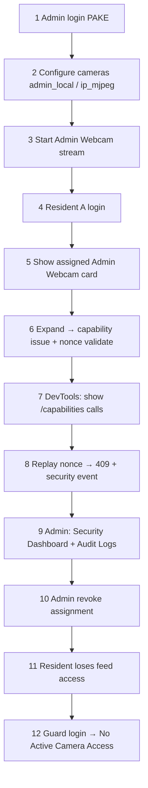

**Step-by-step:**

1. **Admin login** — Use PAKE login on `/login`; observe handshake steps.
2. **Configure cameras** — Set Admin Webcam to `admin_local`; optionally configure IP camera URL.
3. **Start webcam** — Click stream control on Admin Dashboard; verify live feed in grid.
4. **Resident A login** — Dashboard shows assigned Admin Webcam with protected placeholder.
5. **Expand camera** — Triggers capability issue + nonce validation toast.
6. **DevTools Network** — Show `POST /capabilities` and `POST /capabilities/validate`.
7. **Replay test** — Re-send validate with same nonce → 409; check Security Events.
8. **Security Dashboard** — Show auth counts, pending requests, recent events.
9. **Audit Logs** — Show `ACCESS_GRANTED`, `CAMERA_VIEW_STARTED`, etc.
10. **Revoke access** — Admin revokes resident assignment.
11. **Resident refresh** — Feed shows access denied; polling stops on 403.
12. **Guard login** — Empty state: "No Active Camera Access".

---

## 25. Results and Outcomes

This project successfully delivers a **demo-ready zero-trust surveillance access platform** with:

| Outcome | Achievement |
| --- | --- |
| **Secure PAKE login** | SPAKE2 handshake via Node bridge; no plaintext password on wire |
| **Zero-trust camera access** | JWT identity separated from capability authorization |
| **Temporary assignment workflow** | Request → approve → expiring grant |
| **Replay attack detection** | Nonce store with explicit security event |
| **Auditability** | Dual logging to audit_logs and security_events |
| **Role separation** | Distinct admin, resident, viewer, guard experiences |
| **Multi-source cameras** | admin_local, viewer_local, ip_mjpeg support |
| **Test coverage** | 24 automated backend integration tests |
| **Professional UI** | Landing page, dark surveillance dashboards, responsive camera grids |

---

## 26. Limitations

The following limitations are acknowledged for academic honesty:

| Limitation | Detail |
| --- | --- |
| **SQLite local demo** | Not suited for concurrent production write load |
| **In-memory frames** | `CAMERA_FRAMES` dict lost on server restart |
| **Frame polling** | ~500ms JPEG polling, not low-latency WebRTC |
| **Capability in query string** | Required for `` MJPEG; visible in browser network logs |
| **No HTTPS/TLS in dev** | Production would require TLS everywhere |
| **No rate limiting** | Brute-force and DoS mitigations not implemented |
| **Secret management** | JWT secret from config file, not KMS/HSM |
| **AI analytics** | No real ML model; prototype panel not in current routes |
| **No mobile app** | Browser-only deployment |
| **Single tenant** | No organization/tenant isolation |

---

## 27. Future Scope

| Enhancement | Description |
| --- | --- |
| **WebRTC E2E** | Encrypted peer-to-peer video with secure signaling |
| **Real object/motion detection** | Integrate ML model (YOLO, etc.) with labeled bounding boxes |
| **Notification system** | Email/SMS/push on access request, revoke, replay alert |
| **PostgreSQL deployment** | Production-grade persistence and replication |
| **Admin policy engine** | Rule-based auto-approval, time windows, camera groups |
| **Device binding** | Bind capability to device fingerprint |
| **QR-based secure pairing** | Camera onboarding without sharing raw URLs |
| **Mobile app** | Native iOS/Android client with PAKE |
| **Rate limiting** | Per-IP and per-user throttling on auth and capabilities |
| **Log analytics** | SIEM integration, anomaly detection on security events |
| **AI analytics panel** | Re-introduce prototype dashboard with real inference pipeline |
| **Horizontal scaling** | Dedicated media server, Redis nonce store, object storage for frames |

---

## 28. Conclusion

The **Zero-Trust Smart Surveillance Access System** demonstrates how Network Programming and Security principles apply to a practical, modern use case: **protecting live camera feeds**.

- **PAKE authentication** shows that users can prove password knowledge without exposing credentials on the network.
- **JWT identity tokens** establish who is logged in but deliberately do **not** authorize sensitive surveillance actions.
- **Capability tokens** enforce **least privilege** — access is scoped to a specific camera, assignment, and permission.
- **Nonce validation** provides **replay protection**, ensuring captured authorization requests cannot be reused.
- **Audit logs and security events** deliver **accountability**, allowing administrators to review authentication outcomes, approvals, revocations, and attacks.

Together, these mechanisms transform surveillance access from a coarse login model into a **layered, verifiable, time-bounded authorization pipeline**. The FastAPI + React architecture, comprehensive pytest suite, and role-specific dashboards make the system suitable for **final report writing**, **viva demonstration**, and **project handover**.

This project connects classroom NPS topics — secure authentication protocols, token-based identity, authorization models, replay attack prevention, and security monitoring — to a cohesive, working application rather than isolated theoretical exercises.

---

## 29. Related Documentation

| Document | Description |
| --- | --- |
| [API.md](API.md) | Complete API endpoint reference with request bodies |
| [ARCHITECTURE.md](ARCHITECTURE.md) | Supplementary architecture notes |
| [THREAT_MODEL.md](THREAT_MODEL.md) | Expanded threat analysis |
| [DIAGRAMS.md](DIAGRAMS.md) | Additional diagrams |
| [../README.md](../README.md) | Quick start and setup |
| [zero-trust_security_alignment_f14d9258.plan.md](zero-trust_security_alignment_f14d9258.plan.md) | Implementation plan history |

---

*Document version: Expanded master documentation — reflects implemented system as of project completion. AI analytics demo route is listed under future scope; all other described features are implemented and tested unless explicitly marked otherwise.*
