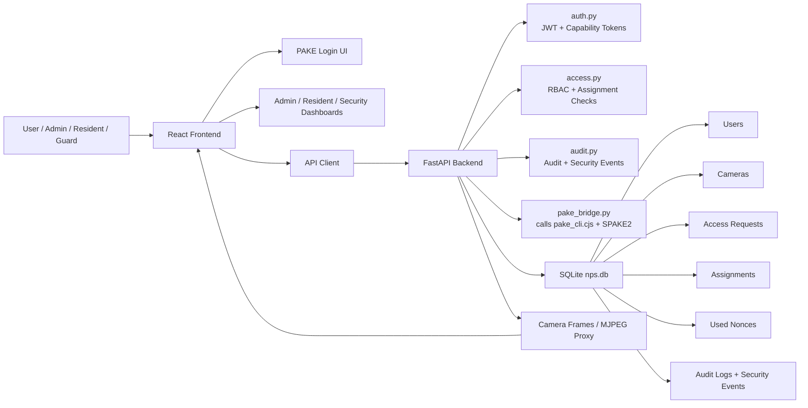
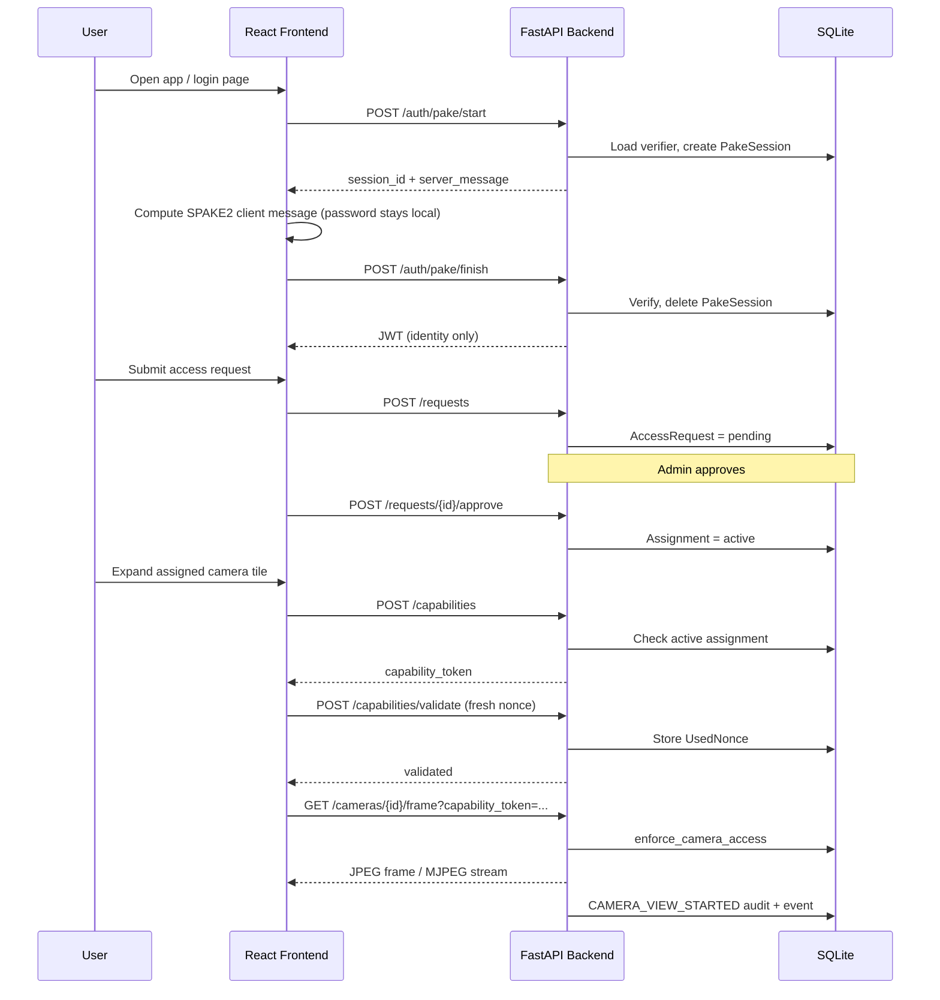
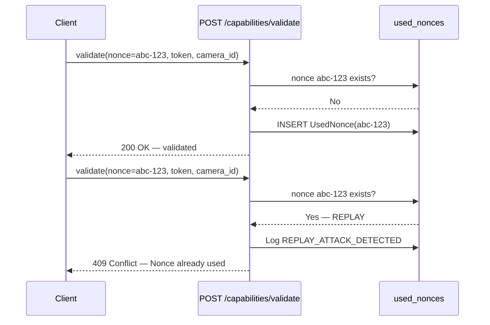
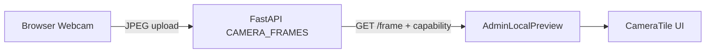

# Secure AI-Based Surveillance System with PAKE Authentication

**Presentation & Viva Preparation Document**

| Field | Detail |
| --- | --- |
| **Course** | Network Programming and Security (NPS Lab) |
| **Project Type** | Secure Surveillance / Zero-Trust Access Control |
| **Implemented System** | Zero-Trust Smart Surveillance Access System using PAKE Authentication |
| **Stack** | React + Vite (Frontend), FastAPI + SQLite (Backend), SPAKE2 (PAKE) |

---

## 1. Project Overview

This project applies **Network Programming and Security** concepts to a realistic surveillance use case: controlling who can view live camera feeds in a residential or small-facility environment.

Most surveillance portals treat **login as authorization** — once a user signs in, they may access many or all cameras. That design is convenient but unsafe. Credentials can be stolen, sessions can be hijacked, and access is often **permanent or too broad**.

Our implemented system takes a different approach: **zero-trust camera access**.

### One-Line Definition

> **A zero-trust surveillance access system where PAKE authenticates users, JWT proves identity, admin-approved assignments grant temporary access, and camera viewing requires capability token + nonce validation.**

### Final Implemented Security Chain

```
PAKE Login → JWT Identity → Request Access → Admin Approval → Assignment →
Capability Token → Nonce Validation → Camera Access → Audit/Security Logs
```

**In simple words:**

1. **PAKE Login** — The user proves they know the password without sending the password over the network.
2. **JWT Identity** — The server issues a token that answers *“Who are you?”* — not *“Which cameras can you watch?”*
3. **Request Access** — A resident or guard asks the admin for access to a specific camera with a reason.
4. **Admin Approval** — The admin reviews and approves or rejects the request.
5. **Assignment** — Approval creates a **time-limited grant** linking the user to specific cameras.
6. **Capability Token** — Before viewing, the user requests a **camera-scoped permission token**.
7. **Nonce Validation** — The user proves the request is fresh by sending a **one-time nonce**; replays are blocked.
8. **Camera Access** — Only then can the user fetch frames or MJPEG streams for that camera.
9. **Audit/Security Logs** — Every important step is recorded for accountability and monitoring.

This chain demonstrates how NPS topics — secure authentication, authorization, replay protection, and logging — work together in a practical system rather than as isolated theory.

---

## 2. 30-Second Elevator Pitch

> *Speaking script for opening the presentation:*

“Traditional surveillance systems often stop thinking about security right after login. Once someone enters a username and password, they may get broad access to many camera feeds — sometimes permanently.

Our project challenges that assumption. We built a **zero-trust surveillance access system** where logging in is **not enough** to watch a camera.

We use **PAKE — Password Authenticated Key Exchange** — so the password is never directly transmitted during login. After authentication, a **JWT** only proves **identity** — who the user is and their role.

Actual camera viewing requires **admin approval**, an **active time-bound assignment**, a **camera-scoped capability token**, and **fresh nonce validation** on every unlock. If an attacker tries to **replay** a captured validation request, the server returns **409 Conflict** and logs **REPLAY_ATTACK_DETECTED**.

Administrators get full visibility through **audit logs** and a **security dashboard** — so every grant, revoke, login, and attack attempt leaves a trace.

In short: we separated **authentication**, **authorization**, and **accountability** — and applied that to a real surveillance workflow.”

---

## 3. Problem Statement

Surveillance systems protect physical spaces, but their **digital access control** is often weak.

**Problems in traditional designs:**

- **Simple username/password login** — Passwords may be intercepted, logged, or stored insecurely.
- **Session token misuse** — A login JWT or session cookie is treated as proof that the user may view any feed.
- **Over-authorization** — One successful login can expose many cameras the user should not see.
- **Permanent access** — Once granted, access may never expire without manual intervention.
- **No approval workflow** — Residents and guards may self-serve into sensitive feeds.
- **Weak accountability** — Admins cannot easily answer *who viewed which camera and when*.
- **Replay vulnerability** — Captured authorization requests or tokens may be reused.
- **Poor role separation** — Admins, residents, and guards may share undifferentiated permissions.

**What we needed:**

- Secure authentication without plaintext password transmission (**PAKE**).
- Identity tokens that do **not** imply camera access (**JWT identity only**).
- **Least privilege** — camera-specific, time-limited grants.
- **Admin approval** before sensitive access.
- **Replay protection** on authorization handshakes.
- **Durable audit trails** for viva demonstration and real-world accountability.

---

## 4. Objectives

### 4.1 Primary Objectives

| # | Objective | Status |
| --- | --- | --- |
| 1 | Implement secure PAKE-based authentication (SPAKE2) | ✅ Implemented |
| 2 | Ensure passwords are not directly transmitted during PAKE login | ✅ Implemented |
| 3 | Issue JWT only as an identity token | ✅ Implemented |
| 4 | Prevent JWT from directly granting assigned camera access | ✅ Implemented |
| 5 | Implement RBAC for admin, resident, security_guard, viewer | ✅ Implemented |
| 6 | Implement request → approve → assignment workflow | ✅ Implemented |
| 7 | Implement time-bound camera assignments | ✅ Implemented |
| 8 | Implement camera-scoped capability tokens | ✅ Implemented |
| 9 | Implement nonce replay protection using `used_nonces` | ✅ Implemented |
| 10 | Log security-critical events | ✅ Implemented |
| 11 | Provide audit logs and security dashboard | ✅ Implemented |

### 4.2 Secondary Objectives

| # | Objective | Status |
| --- | --- | --- |
| 1 | Support admin local webcam and IP MJPEG camera sources | ✅ Implemented |
| 2 | Allow residents/viewers/guards to request admin camera access | ✅ Implemented |
| 3 | Support soft revoke and automatic expiry | ✅ Implemented |
| 4 | Provide demo-friendly role-specific dashboards | ✅ Implemented |
| 5 | Prototype AI/security analytics demo page | ⚠️ **Future scope** — no `AnalyticsDemo.tsx` route in current `App.tsx` |
| 6 | Complete documentation for presentation and viva | ✅ Implemented (`MASTER_DOCUMENTATION.md`, this file) |

---

## 5. Simple System Architecture



### Layer Explanation

#### Frontend (`Frontend/`)

- **Landing page** (`/`) and **login page** (`/login`) with PAKE handshake visualization.
- **Role dashboards:** Admin (`/admin`), Resident/Viewer/Guard (`/viewer`).
- **Security pages:** Security Dashboard, Audit Logs, Security Events (admin only).
- **Request Access** page (`/requests`) for residents/guards.
- **API client** (`lib/api.ts`) and **PAKE client** (`lib/pake.ts`) talk to the backend.

#### Backend (`backend/app/`)

- **FastAPI** routes in `main.py` orchestrate all HTTP endpoints.
- **Authentication** via `auth.py` (password hash, JWT, capability JWT).
- **Authorization** via `access.py` (RBAC, assignments, capabilities, nonces).
- **Logging** via `audit.py` (security events, audit logs, expiry pruning).
- **PAKE bridge** via `pake_bridge.py` → Node `pake_cli.cjs` (SPAKE2).

#### Database (`backend/nps.db`)

SQLite stores persistent state:

- Users (with PAKE salt/verifier)
- Cameras and source configuration
- Access requests and assignments
- Used nonces (replay protection)
- Audit logs and security events
- Short-lived PAKE sessions

#### Camera Layer

Demo-grade streaming (not WebRTC):

- **`admin_local`** — Admin browser webcam uploads JPEG frames to backend in-memory store.
- **`viewer_local`** — Owner uploads frames from their browser webcam.
- **`ip_mjpeg`** — Backend proxies a network MJPEG URL.
- **`unconfigured`** — Placeholder until admin sets source.

Frames are held in an in-memory `CAMERA_FRAMES` dictionary in `main.py` (lost on server restart).

---

## 6. End-to-End Zero-Trust Workflow



### Step-by-Step Explanation

| Step | What Happens |
| --- | --- |
| 1 | User opens the frontend landing or login page. |
| 2 | User logs in through **PAKE** (`/auth/pake/start` → `/auth/pake/finish`). |
| 3 | Backend verifies proof of password knowledge via SPAKE2 bridge — password never sent directly. |
| 4 | Backend issues **JWT** containing `sub` (user id) and `role` only. |
| 5 | Resident/guard requests camera access via `POST /requests` with a reason. |
| 6 | Admin reviews pending requests on Admin Dashboard. |
| 7 | Admin approves → creates **active assignment** with `expires_at`. |
| 8 | User sees assigned camera metadata on ViewerDashboard (feed still protected). |
| 9 | User expands camera → frontend calls `POST /capabilities`. |
| 10 | Backend issues **camera-scoped capability token** bound to assignment. |
| 11 | Frontend sends `POST /capabilities/validate` with a **fresh UUID nonce**. |
| 12 | Backend stores nonce in `used_nonces` — replay blocked on reuse. |
| 13 | Camera feed unlocks — frame polling or MJPEG stream with capability query param. |
| 14 | `CAMERA_VIEW_STARTED`, audit logs, and security events are written. |

> **Key point for viva:** JWT alone is **not sufficient** to view an assigned admin camera. The user must also hold a valid capability token and pass nonce validation.

---

## 7. Old Workflow vs New Workflow

### Earlier Workflow (Before Zero-Trust Alignment)

```
PAKE/JWT login → assignment check → camera access
```

**What was missing:**

| Gap | Impact |
| --- | --- |
| No `POST /api/v1/capabilities` | No camera-scoped authorization token |
| No `POST /api/v1/capabilities/validate` | No explicit unlock handshake |
| No `UsedNonce` enforcement | Replay attacks possible |
| No `REPLAY_ATTACK_DETECTED` logging | Attacks invisible to admin |
| No `GET /api/v1/audit-logs` | Weak accountability |
| No `GET /api/v1/security-dashboard` | No security telemetry |
| No `/security-events` alias | Inconsistent API surface |
| Incomplete limited-role handling | `resident` / `security_guard` not fully enforced |
| Hard delete on revoke | Lost audit history |
| No capability-gated frame/stream | JWT + assignment was the only gate |

### Updated Workflow (Current Implementation)

```
PAKE → JWT → request access → admin approval → assignment →
capability token → nonce validation → camera access → audit/security logs
```

### Comparison Table

| Area | Earlier Workflow | Updated Workflow |
| --- | --- | --- |
| **Login** | PAKE/JWT existed | PAKE remains primary secure login |
| **JWT** | Used for identity and much of access flow | JWT proves **identity only** |
| **Camera Access** | JWT + assignment check | Assignment + **capability token** + **nonce** |
| **Replay Protection** | Not fully wired | `UsedNonce` blocks replay → **409** |
| **Revoke** | Could delete assignment | **Soft revoke** with `status=revoked`, `revoked_at` |
| **RBAC** | Some checks only handled `viewer` | `resident`, `guard`, `viewer` as **limited roles** |
| **Logs** | Partial security events | Audit logs + dashboard + security events |
| **Demo Proof** | Basic access control | **409 replay rejection** + `REPLAY_ATTACK_DETECTED` |

---

## 8. Module-Wise Explanation

### 8.1 Frontend Modules

| Module | Route / Path | Purpose |
| --- | --- | --- |
| **LandingPage.tsx** | `/` | Public project landing with features and CTA |
| **LoginPage.tsx** | `/login` | Wraps login UI with themed layout |
| **Login.tsx** | (inside LoginPage) | PAKE login form; 5-step handshake visualization; role-based login buttons |
| **lib/pake.ts** | — | Browser-side SPAKE2 client; password stays local during computation |
| **lib/api.ts** | — | Central HTTP client: auth, cameras, requests, assignments, capabilities, audit, dashboard |
| **AdminDashboard.tsx** | `/admin` | Camera list, live feed grid, pending requests, assignments, revoke, links to security pages |
| **ViewerDashboard.tsx** | `/viewer` | Owned + assigned cameras; capability issue/validate before feed unlock; guard empty state |
| **RequestHistory.tsx** | `/requests` | Submit and track access requests |
| **SecurityDashboard.tsx** | `/security-dashboard` | Auth/request/expiry/revoke metrics; recent events and audit snippets |
| **AuditLogs.tsx** | `/audit-logs` | Full audit trail table |
| **SecurityEvents.tsx** | `/security-events` | Security alerts including replay and unauthorized access |
| **CameraTile.tsx** | — | Surveillance-style camera card with expand, REC badge, preview viewport |
| **AdminLocalPreview.tsx** | — | Polls `/frame` with capability token; stops on 401/403 |
| **AdminLocalStreamer.tsx** | — | Captures admin webcam and uploads JPEG frames |
| **ViewerLocalStreamer.tsx** | — | Captures viewer-owned webcam frames |
| **AppContext.tsx** | — | Session state, dashboard data, login/logout, refresh |

> **AnalyticsDemo.tsx:** This file is **not present** in the current codebase and has **no route** in `App.tsx`. A prototype AI analytics panel was discussed during development but is **future scope**, not a demo-ready page today.

### 8.2 Backend Modules

| Module | Responsibility |
| --- | --- |
| **main.py** | FastAPI app; all routes; in-memory `CAMERA_FRAMES`; wires auth, access, audit |
| **access.py** | `LIMITED_ROLES`; assignment checks; capability issue/validate; nonce store; `enforce_camera_access` |
| **auth.py** | Argon2id password hash; JWT access token; capability JWT with `jti`; decode helpers |
| **deps.py** | `get_current_user`, `require_admin`; Bearer token extraction |
| **audit.py** | `log_event`, `write_audit_log`, `prune_expired_assignments`, throttled unauthorized logging |
| **models.py** | SQLAlchemy ORM: User, Camera, AccessRequest, Assignment, AuditLog, SecurityEvent, PakeSession, UsedNonce |
| **schemas.py** | Pydantic request/response DTOs |
| **seed.py** | Demo users, cameras, sample assignment for `resident_a`, pending request for `resident_b` |
| **pake_bridge.py** | Python subprocess bridge to Node PAKE CLI |
| **pake_cli.cjs** | Node SPAKE2: `verifier`, `start`, `finish` actions |
| **database.py** | SQLite engine; `ensure_security_project_columns()` migration for assignment columns |

### 8.3 Database Entities

| Entity | Purpose |
| --- | --- |
| **User** | Accounts with `role`, `password_hash`, `pake_salt`, `pake_verifier` |
| **Camera** | Feed metadata, `source_type`, `owner_id`, share flags, `is_active` |
| **AccessRequest** | Resident/guard request with `reason`, `status` (pending/approved/rejected) |
| **Assignment** | Time-bounded grant; `camera_ids`; `status` (active/expired/revoked) |
| **SecurityEvent** | Severity/category alerts for security dashboard |
| **AuditLog** | Actor/target accountability trail |
| **PakeSession** | Short-lived SPAKE2 server state during login |
| **UsedNonce** | Consumed nonces for replay protection |

---

## 9. PAKE Authentication Explanation

**PAKE** stands for **Password Authenticated Key Exchange**.

### Why PAKE?

In a normal login, the client might send the password to the server. If the channel is compromised or misconfigured, the password can be exposed. PAKE lets the client **prove password knowledge** through cryptographic messages instead.

### How It Works in Our Project (Simple Language)

1. User enters username and password in the browser.
2. Frontend calls `POST /api/v1/auth/pake/start` with the username.
3. Backend loads the user's **PAKE salt** and **verifier** from the database.
4. Backend calls `pake_bridge.py` → `pake_cli.cjs` to start SPAKE2 and returns a **server message**.
5. Frontend (`lib/pake.ts`) uses the password **locally** to compute the **client message** — password is not sent in the finish request.
6. Frontend calls `POST /api/v1/auth/pake/finish` with `session_id` and `client_message`.
7. Backend verifies via the bridge; deletes the temporary `PakeSession`.
8. On success, backend issues a **JWT** and logs `LOGIN_SUCCESS`.

### Implementation Chain

| Layer | File / Route |
| --- | --- |
| Browser client | `Frontend/src/lib/pake.ts` |
| Start route | `POST /api/v1/auth/pake/start` |
| Finish route | `POST /api/v1/auth/pake/finish` |
| Python bridge | `backend/app/pake_bridge.py` |
| Node CLI | `backend/pake_cli.cjs` |
| Protocol | SPAKE2 via `spake2` npm package |

### Legacy Login (Compatibility)

`POST /api/v1/auth/login` still exists for tests and fallback. It verifies `password_hash` directly. **PAKE is the primary secure path** demonstrated in the frontend login UI.

### Viva Talking Point

“We use PAKE to protect the **authentication phase**. Authorization for cameras is a **separate phase** handled by assignments, capability tokens, and nonces.”

---

## 10. JWT vs Capability Token

### Conceptual Separation

| Question | Answered By |
| --- | --- |
| “Who is this user?” | **JWT identity token** |
| “Can this user view this specific camera right now?” | **Capability token** |

A stolen JWT lets an attacker call general APIs as that user — but it should **not** let them view assigned admin cameras without going through capability + nonce + active assignment checks.

### Comparison Table

| Feature | JWT Identity Token | Camera Capability Token |
| --- | --- | --- |
| **Purpose** | Proves user identity | Grants camera-specific access |
| **Scope** | User/session level | User + camera + assignment |
| **Contains** | `sub`, `role`, `iat`, `exp` | `sub`, `camera_id`, `assignment_id`, `permissions`, `jti`, `exp`, `typ=capability` |
| **Used for** | API authentication (Bearer header) | Camera authorization (frame/stream + validate) |
| **Camera-specific** | No | Yes |
| **Expiry** | Session expiry (~configurable minutes) | Tied to assignment (max 15 min for assigned cameras) |
| **Zero-trust role** | Identity only | Least-privilege permission (`VIEW`) |

### Capability Token Payload (from `auth.py`)

```json
{
  "typ": "capability",
  "sub": "3",
  "camera_id": 1,
  "assignment_id": "uuid-here",
  "permissions": ["VIEW"],
  "jti": "unique-token-id",
  "iat": 1710000000,
  "exp": 1710000900
}
```

The `jti` (JWT ID) gives each capability token a unique identifier.

---

## 11. Nonce Replay Protection

### What Is a Replay Attack?

An attacker captures a valid **capability validation request** (token + nonce) and **sends it again** to regain or extend access. Without protection, the server might accept the duplicate.

### Our Defense

1. Client generates a **fresh UUID nonce** for each validation.
2. `POST /api/v1/capabilities/validate` checks `used_nonces` table.
3. **First use** → nonce stored → validation succeeds.
4. **Reuse** → `409 Conflict` → `REPLAY_ATTACK_DETECTED` logged.

This has been **manually verified** during demo preparation and covered by automated tests (`test_rbac.py`, `test_zero_trust_workflow.py`).



### Viva Answer

“Nonce replay protection ensures that even if an attacker captures a validation request, they cannot reuse it. Each authorization handshake is **single-use**.”

---

## 12. RBAC and Access Control

### Roles

| Role | Access Level | Camera Visibility |
| --- | --- | --- |
| **admin** | Full control | All cameras; configure sources; approve/reject; revoke |
| **resident** | Limited | Owned cameras + actively assigned cameras |
| **security_guard** | Limited | **Only** actively assigned cameras |
| **viewer** | Limited (legacy) | Treated same as resident in `access.py` |

### Admin Capabilities

- Configure admin cameras (`admin_local`, `ip_mjpeg`).
- Upload admin webcam frames.
- Approve/reject access requests.
- Create and revoke assignments.
- View audit logs, security events, security dashboard.
- Manage users via admin user routes.

### Limited Role Rules (`access.py`)

- `LIMITED_ROLES = {viewer, resident, security_guard}`
- `user_can_access_camera()` — admin, owner, or active assignment required.
- `user_requires_capability_for_camera()` — limited roles need capability on **non-owned** assigned cameras.
- `enforce_camera_access()` — frame/stream gate with optional `capability_token` query param.

### Guard With No Assignment

`guard_a` (seeded with no assignment) sees **“No Active Camera Access”** on ViewerDashboard. Backend returns empty assignments and denies frame access.

### Revocation and Expiry

- **Expired** — `prune_expired_assignments()` sets `status=expired`; `ACCESS_EXPIRED` logged.
- **Revoked** — Admin `DELETE /assignments/{id}` sets `status=revoked`, `revoked_at`; row **retained** for audit.
- Expired/revoked assignments **cannot** issue new capability tokens.

---

## 13. Request, Approval, Assignment Lifecycle

### Access Request Flow

1. Resident opens **Request Access** (`/requests`).
2. Frontend loads requestable cameras via `GET /api/v1/cameras/requestable`.
3. Resident submits `POST /api/v1/requests` with `camera_id` and `reason`.
4. Request stored as **`pending`**; `REQUEST_CREATED` logged.
5. Admin sees pending queue on Admin Dashboard.
6. Admin **approves** (`POST /requests/{id}/approve` with `duration_hours`) or **rejects**.

### On Approval

- Request status → `approved`
- New **Assignment** created: `status=active`, `expires_at` set
- `REQUEST_APPROVED` + `ACCESS_GRANTED` logged

### Assignment States

| Status | Meaning | Can View Camera? |
| --- | --- | --- |
| `active` | Within `expires_at` | Yes (with capability + nonce) |
| `expired` | Past `expires_at` | No |
| `revoked` | Admin revoked | No |

### Seeded Demo Data

- `resident_a` — pre-approved assignment to **Admin Webcam** (~22 hours remaining).
- `resident_b` — **pending** request for **Admin IP Camera**.

---

## 14. Camera Streaming Flow

### Supported Source Types

| `source_type` | How It Works |
| --- | --- |
| `admin_local` | Admin browser captures JPEG → `POST /admin/cameras/{id}/frame` → in-memory store |
| `viewer_local` | Owner captures JPEG → `POST /cameras/{id}/frame` |
| `ip_mjpeg` | Backend proxies `source_url` via `GET /cameras/{id}/stream` |
| `unconfigured` | No feed until admin configures source |

### Authorized Viewer Access

After capability validation, `AdminLocalPreview.tsx` polls `GET /cameras/{id}/frame` every ~500ms with `capability_token` query parameter. MJPEG uses `getCameraCapabilityStreamUrl()` with token in query string (browser `` limitation).



### Honest Limitation (Say This in Viva)

> “Our current implementation uses **JPEG frame polling** and **MJPEG proxy** for demonstration. It is **not WebRTC** and does **not** provide end-to-end encrypted real-time video. WebRTC E2E streaming is **future scope**.”

---

## 15. Audit Logs and Security Dashboard

### Security Events vs Audit Logs

| Store | Focus | Example Use |
| --- | --- | --- |
| **SecurityEvent** | Alerts, severity, monitoring | Replay attack, unauthorized access |
| **AuditLog** | Accountability, who did what | Access granted, request approved, camera viewed |

### Key Event Types (Implemented)

| Event | When |
| --- | --- |
| `LOGIN_SUCCESS` | PAKE finish or legacy login OK |
| `LOGIN_FAILURE` | Bad credentials, expired PAKE session |
| `REQUEST_CREATED` | User submits access request |
| `REQUEST_APPROVED` | Admin approves |
| `REQUEST_REJECTED` | Admin rejects |
| `ACCESS_GRANTED` | Assignment created |
| `ACCESS_REVOKED` | Admin revokes assignment |
| `ACCESS_EXPIRED` | Assignment past `expires_at` |
| `CAMERA_VIEW_STARTED` | Successful capability validation |
| `REPLAY_ATTACK_DETECTED` | Duplicate nonce on validate |
| `UNAUTHORIZED_CAMERA_ACCESS` | Frame/stream denied (throttled 45s per user+camera) |

### Security Dashboard Metrics (`GET /api/v1/security-dashboard`)

- Authentication success / failure counts
- Pending / approved / rejected requests
- Expired / revoked assignments
- Recent security events
- Recent audit logs

---

## 16. Demo Credentials

| Role | Username | Password | Notes |
| --- | --- | --- | --- |
| Admin | `admin_user` | `admin123` | Full control |
| Resident | `resident_a` | `resident123` | Seeded assignment to Admin Webcam |
| Resident | `resident_b` | `resident123` | Pending request for Admin IP Camera |
| Security Guard | `guard_a` | `guard123` | No assignment by default |
| Legacy Viewer | `viewer_a` | `viewer123` | RBAC same as resident |
| Legacy Viewer | `viewer_b` | `viewer123` | RBAC same as resident |

> **Fresh database:** Delete `backend/nps.db` and restart backend to re-run `seed.py`.

---

## 17. Live Demo Script

### Speaker 1: Introduction and Problem

> **Script:**

“Good morning. Our project is titled **Secure AI-Based Surveillance System with PAKE Authentication**. It is a Network Programming and Security lab project focused on **secure surveillance access control**.

The core problem is that normal surveillance systems trust **login alone**. Once authenticated, users may access broad camera feeds with little accountability.

Our solution is a **zero-trust pipeline**: PAKE for secure login, JWT for identity only, admin-approved temporary assignments, camera-scoped capability tokens, nonce replay detection, and full audit logging.

We will demonstrate that a resident cannot view a camera simply by logging in — they need explicit approval and a fresh authorization handshake.”

---

### Speaker 2: Architecture and Workflow

> **Script:**

“Let me walk through the architecture. The **React frontend** handles PAKE login, role dashboards, and capability-gated camera tiles. The **FastAPI backend** enforces RBAC, assignments, capability tokens, and nonce validation. **SQLite** stores users, cameras, requests, assignments, nonces, and logs.

The security chain is:

**PAKE → JWT → Request → Approve → Assignment → Capability → Nonce → Camera → Logs**

The critical design choice is that **JWT proves identity but does not unlock cameras**. Capability tokens and nonces handle authorization.”

*[Show Section 5 architecture diagram and Section 6 workflow diagram.]*

---

### Speaker 3: Live Demo

> **Script and steps:**

**Setup (before presentation):**

```bash
# Terminal 1
cd backend
python -m uvicorn app.main:app --reload --host 127.0.0.1 --port 8000

# Terminal 2
cd Frontend
npm run dev
```

| Step | Action | What to Say |
| --- | --- | --- |
| 1 | Open `http://localhost:5173` | “This is our landing page.” |
| 2 | Go to `/login`, login as `admin_user` | “Watch the PAKE handshake — password stays local.” |
| 3 | Admin Dashboard | “Admin sees all cameras, live feeds, pending requests.” |
| 4 | Configure Admin Webcam → `admin_local`, click **Start Stream** | “Admin uploads JPEG frames from browser webcam.” |
| 5 | Show pending request from `resident_b` | “Residents request access with a reason.” |
| 6 | Logout, login as `resident_a` | “Resident sees only assigned Admin Webcam.” |
| 7 | Open **DevTools → Network** | “We will trace the zero-trust unlock.” |
| 8 | Expand assigned camera tile | “Protected feed until capability validated.” |
| 9 | Observe `POST /api/v1/capabilities` | “Backend issues camera-scoped token.” |
| 10 | Observe `POST /api/v1/capabilities/validate` | “Fresh nonce consumed — single use.” |
| 11 | Feed unlocks | “Only now does frame polling succeed.” |
| 12 | Replay same nonce (PowerShell/Postman) | “Second validate returns **409 Conflict**.” |
| 13 | Open `/security-events` | “**REPLAY_ATTACK_DETECTED** is logged.” |
| 14 | Open `/security-dashboard` and `/audit-logs` | “Full security telemetry.” |
| 15 | Login admin, revoke `resident_a` assignment | “Soft revoke — history preserved.” |
| 16 | Login `resident_a` again | “Access denied; polling stops on 403.” |
| 17 | Login `guard_a` | “Guard with no assignment sees empty state.” |

**Replay test example (PowerShell):**

```powershell
# After capturing token, camera_id, and nonce from first validate:
Invoke-RestMethod -Method POST -Uri "http://127.0.0.1:8000/api/v1/capabilities/validate" `
  -Headers @{ Authorization = "Bearer <resident_jwt>" } `
  -ContentType "application/json" `
  -Body '{"camera_id":1,"capability_token":"<token>","nonce":"<same-nonce>"}'
# Expected: 409 Conflict on second call
```

---

### Speaker 4: Testing, Outcomes, Future Scope

> **Script:**

“We verified the system with **24 backend pytest tests** — all passing — covering auth, assignments, RBAC, audit, and the full zero-trust workflow including replay detection.

The frontend **production build** also passes via `npm run build`.

**Outcomes:** PAKE secure login, JWT/capability separation, temporary assignments, replay protection, auditability, and role-specific dashboards.

**Limitations:** Demo uses SQLite and in-memory frames; streaming is JPEG polling/MJPEG proxy, not WebRTC. AI analytics is future scope — not a live routed page today.

**Future work:** WebRTC E2E, real ML detection, PostgreSQL, rate limiting, mobile app.

In conclusion, we applied NPS principles to a real surveillance workflow — authentication, least privilege, replay protection, and accountability.”

---

## 18. What We Verified

### Automated Verification

- [x] Backend tests: **24 passed** (`python -m pytest tests/ -q`)
- [x] Frontend production build passed (`npm run build`)

### API Routes Verified

- [x] `POST /api/v1/capabilities`
- [x] `POST /api/v1/capabilities/validate`
- [x] `GET /api/v1/audit-logs`
- [x] `GET /api/v1/security-dashboard`
- [x] `GET /api/v1/security-events`
- [x] `GET /api/v1/security/events` (alias)

### Database Schema Verified

- [x] `assignments` has `status`, `revoked_at`, `user_id`, `camera_id`, `granted_by`, `access_request_id`
- [x] `used_nonces` table exists
- [x] `audit_logs` and `security_events` tables exist
- [x] `pake_sessions` table exists

### Manual Verification

- [x] Admin login (`admin_user`) via PAKE
- [x] Resident login (`resident_a`)
- [x] Guard login (`guard_a`)
- [x] Resident sees assigned camera only (not all admin cameras)
- [x] Guard with no assignment sees no active camera access
- [x] Capability issue verified (`POST /capabilities`)
- [x] Capability validation verified (`POST /capabilities/validate`)
- [x] Replay same nonce → **409 Conflict**
- [x] `REPLAY_ATTACK_DETECTED` in Security Events
- [x] Audit logs page loads with grant/revoke/view events
- [x] Security dashboard shows metrics
- [x] Soft revoke — assignment row retained with `status=revoked`

---

## 19. Outcomes

| Outcome | Detail |
| --- | --- |
| **Secure authentication** | PAKE (SPAKE2) via Python–Node bridge; password not directly transmitted |
| **Identity/authorization separation** | JWT for identity; capability token for camera `VIEW` permission |
| **Temporary access** | Admin-approved assignments with `expires_at` |
| **Replay prevention** | `UsedNonce` store; 409 on reuse; security event logged |
| **Admin control** | Approve, reject, revoke with audit trail |
| **Least privilege** | Residents/guards see only owned or assigned cameras |
| **Accountability** | `AuditLog` for actions; `SecurityEvent` for alerts |
| **Visibility** | Security dashboard with auth, request, and revocation metrics |
| **NPS demonstration** | Practical application of secure auth, RBAC, replay protection, logging |
| **Demo-ready UI** | Landing page, PAKE visualization, surveillance-style dashboards |

---

## 20. Limitations

| Limitation | Honest Explanation |
| --- | --- |
| **Streaming technology** | JPEG frame polling (~500ms) and MJPEG proxy — **not WebRTC** |
| **Frame storage** | In-memory `CAMERA_FRAMES` — lost on server restart |
| **AI analytics** | **Not implemented** as a live page; no real ML object detection |
| **Database** | SQLite for local demo — not production-grade concurrency |
| **TLS/HTTPS** | Dev environment — production needs TLS everywhere |
| **Secret management** | JWT secret from config — no KMS/HSM |
| **Rate limiting** | Not implemented — brute-force/DoS mitigations are future work |
| **Capability in query string** | Required for ``/MJPEG — visible in browser network logs |
| **Scale** | Single-tenant demo — not enterprise multi-tenant |

---

## 21. Future Scope

| Enhancement | Description |
| --- | --- |
| **WebRTC streaming** | Real-time low-latency video |
| **E2E encrypted media** | Encrypted video channel with secure signaling |
| **Real AI detection** | Object/motion/face/license plate models on live feeds |
| **AI analytics dashboard** | Re-introduce prototype panel with real inference pipeline |
| **PostgreSQL** | Production persistence and replication |
| **Cloud deployment** | Containerized backend + managed database |
| **Rate limiting** | Per-IP and per-user throttling on auth and capabilities |
| **Device binding** | Tie capability tokens to device fingerprint |
| **Notification system** | Alert admin on request, revoke, replay attack |
| **Mobile app** | Native client with PAKE login |
| **SIEM integration** | Log analytics and anomaly detection |

---

## 22. Final Conclusion

Our project demonstrates how **Network Programming and Security** concepts can be applied to a real surveillance system.

Instead of trusting login alone, the system uses:

- **PAKE authentication** — secure password proof without direct transmission
- **JWT identity separation** — session token does not imply camera access
- **Role-based access control** — admin, resident, guard, viewer with backend enforcement
- **Temporary assignments** — time-bounded, admin-approved grants
- **Capability tokens** — least-privilege, camera-scoped authorization
- **Nonce replay protection** — single-use authorization handshakes
- **Audit logging** — accountability for every critical action

This makes the surveillance workflow **more secure, auditable, and aligned with zero-trust principles** — suitable for academic demonstration, viva defense, and project handover.

---

## Quick Reference Links

| Document | Purpose |
| --- | --- |
| [MASTER_DOCUMENTATION.md](MASTER_DOCUMENTATION.md) | Full technical report |
| [API.md](API.md) | Endpoint reference |
| [ARCHITECTURE.md](ARCHITECTURE.md) | Architecture notes |
| [THREAT_MODEL.md](THREAT_MODEL.md) | Threat analysis |
| [../README.md](../README.md) | Quick start |

---

*This presentation document reflects the implemented system as verified against the codebase. Test count: 24 passed. AnalyticsDemo route: not present — future scope.*
