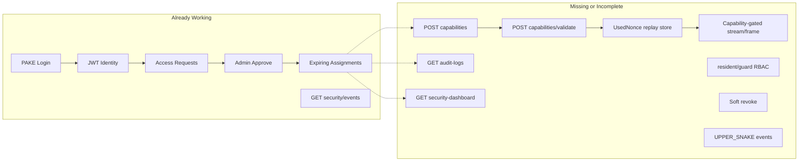

# Zero-Trust Security Implementation Plan

## Current State Summary

The repo is **halfway between design and implementation**. Documentation ([docs/ARCHITECTURE.md](docs/ARCHITECTURE.md), [docs/API.md](docs/API.md), [docs/THREAT_MODEL.md](docs/THREAT_MODEL.md)) and tests describe the full chain, but [backend/app/main.py](backend/app/main.py) still operates on a **JWT + assignment (viewer-only)** model.

### Partially supported today (reuse, do not rewrite)

| Area | Existing assets |
|------|-----------------|
| PAKE auth | [backend/app/main.py](backend/app/main.py) PAKE routes, [Frontend/src/lib/pake.ts](Frontend/src/lib/pake.ts), [Frontend/src/context/AppContext.tsx](Frontend/src/context/AppContext.tsx) (PAKE-only login) |
| JWT helpers | [backend/app/auth.py](backend/app/auth.py) `create_access_token`, `decode_access_token` |
| Capability helpers | [backend/app/auth.py](backend/app/auth.py) `create_capability_token`, `decode_capability_token` |
| Schemas | [backend/app/schemas.py](backend/app/schemas.py) `CapabilityIssueRequest`, `CapabilityValidateRequest`, `AuditLogOut`, `SecurityDashboardOut` |
| Models | [backend/app/models.py](backend/app/models.py) `UsedNonce`, `AuditLog`, extended `Assignment` (`status`, `revoked_at`, `user_id`, `camera_id`, etc.) |
| Audit utilities | [backend/app/audit.py](backend/app/audit.py) `log_event`, `write_audit_log`, `prune_expired_assignments` (already emits `ACCESS_EXPIRED`) |
| DB migration hook | [backend/app/database.py](backend/app/database.py) `ensure_security_project_columns()` — **exists but not called from startup** |
| Access request flow | Backend routes + [Frontend/src/pages/RequestHistory.tsx](Frontend/src/pages/RequestHistory.tsx) |
| Admin UI shell | [Frontend/src/pages/AdminDashboard.tsx](Frontend/src/pages/AdminDashboard.tsx), [SecurityDashboard.tsx](Frontend/src/pages/SecurityDashboard.tsx), [AuditLogs.tsx](Frontend/src/pages/AuditLogs.tsx) |
| Capability UI (partial) | [Frontend/src/pages/ViewerDashboard.tsx](Frontend/src/pages/ViewerDashboard.tsx) issues/validates token on expand, but **does not use it for streaming** |
| Tests (target behavior) | [backend/tests/test_zero_trust_workflow.py](backend/tests/test_zero_trust_workflow.py), [backend/tests/test_audit.py](backend/tests/test_audit.py) |

### Critical gaps blocking end-to-end flow

1. **404 routes**: `POST /capabilities`, `POST /capabilities/validate`, `GET /audit-logs`, `GET /security-dashboard` (tests also expect `GET /security-events` alias)
2. **JWT still gates camera access** in `GET /cameras/{id}/frame` and `GET /cameras/{id}/stream` ([main.py](backend/app/main.py) ~522–613)
3. **Role checks only target `UserRole.viewer`** — `resident` and `security_guard` bypass assignment filters
4. **Revoke hard-deletes** assignments ([main.py](backend/app/main.py) ~899–919)
5. **Event names inconsistent** — code uses `login_success`, tests/docs expect `LOGIN_SUCCESS`
6. **`write_audit_log()` never called** from routes; audit table mostly empty
7. **Frontend stream URL** uses `getCameraStreamUrl()` (JWT), not `getCameraCapabilityStreamUrl()` ([Frontend/src/lib/api.ts](Frontend/src/lib/api.ts) line 28)

---

## Recommended Implementation Order

Work in this order to unblock tests early and avoid rework.

### Phase 0 — Database/bootstrap safety (prerequisite)

**Files:** [backend/app/main.py](backend/app/main.py), [backend/app/database.py](backend/app/database.py)

- Call `ensure_security_project_columns()` inside `startup()` alongside existing `ensure_user_pake_columns()` / `ensure_camera_source_columns()`
- Ensure `list_assignments` filters `status == "active"` (not just `expires_at > now`) once soft-revoke lands

**Risk:** Existing SQLite DBs missing `assignments.status` / `revoked_at` will break approve/dashboard queries until migration runs.

---

### Phase 1 — Shared authorization helpers (Task 1 foundation)

**Files:** [backend/app/deps.py](backend/app/deps.py) (new helpers), [backend/app/main.py](backend/app/main.py)

Add helpers:

- `LIMITED_ROLES = {viewer, resident, security_guard}`
- `is_limited_role(user) -> bool`
- `user_has_active_assignment(db, user_id, camera_id) -> Assignment | None` (checks `status == "active"` and `expires_at > now`, camera in `camera_ids` or matches `camera_id`)
- `user_can_access_camera(db, user, camera) -> bool` (admin: all; owner: own cameras; limited roles: assigned only)

Apply to these handlers (currently viewer-only or unfiltered):

| Route | Current bug |
|-------|-------------|
| `GET /cameras` (~376) | Filters only `viewer` |
| `GET /assignments` (~848) | Filters only `viewer`; no `status` filter |
| `GET /cameras/{id}/frame` (~537) | Assignment gate only for `viewer` |
| `GET /cameras/{id}/stream` (~574) | Same |
| `POST /assignments` (~863) | Only accepts `viewer_id` with role `viewer` |
| `POST /admin/users` (~785, ~798) | Cannot create `resident` / `security_guard` |
| `GET /cameras/requestable` (~441) | No role restriction documented in API |

**Risk:** Changing `GET /cameras` will immediately hide unassigned cameras from residents/guards — correct per zero-trust, but may surprise demo users until they request access.

---

### Phase 2 — Capability issue + validate + nonce replay (Tasks 2–4)

**Files:** [backend/app/main.py](backend/app/main.py), [backend/app/auth.py](backend/app/auth.py), [backend/app/audit.py](backend/app/audit.py), [backend/app/models.py](backend/app/models.py)

#### `POST /api/v1/capabilities`

Logic:

1. Require JWT (`get_current_user`)
2. `prune_expired_assignments(db)`
3. Verify active assignment for `(user_id, camera_id)` OR user is admin OR user owns camera
4. Issue token via `create_capability_token(user_id, camera_id, assignment_id, permissions, expires_at=min(assignment.expires_at, now+short_ttl))`
5. Log `ACCESS_GRANTED` (security) + audit entry on first view intent (or defer to validate — recommend logging at validate with `CAMERA_VIEW_STARTED`)

Return `CapabilityTokenOut`.

#### `POST /api/v1/capabilities/validate`

Logic:

1. Require JWT
2. `decode_capability_token()` — verify `sub == user.id`, `camera_id` matches, `typ == capability`, not expired
3. Verify assignment still active (or admin/owner exception)
4. **Nonce replay check** via `UsedNonce`:
   - If `(user_id, nonce)` exists → `409 Conflict`, log `REPLAY_ATTACK_DETECTED`
   - Else insert nonce with TTL (e.g. capability exp or 15 min)
5. On success: log `CAMERA_VIEW_STARTED`, `write_audit_log(...)`, return `CapabilityValidateOut`

**Risks:**

- Unique constraint: add composite unique index on `(user_id, nonce)` or catch integrity error
- Test uses hardcoded nonce `"faculty-demo-nonce-001"` — must persist across two validate calls
- `test_zero_trust_workflow.py` issues capability for `resident_a` on camera 1 — seed must include active assignment for that pair (verify [backend/app/seed.py](backend/app/seed.py))

---

### Phase 3 — Audit logs + security dashboard routes (Tasks 5–6)

**Files:** [backend/app/main.py](backend/app/main.py), [backend/app/audit.py](backend/app/audit.py)

#### `GET /api/v1/audit-logs` (admin only)

- Return recent `AuditLog` rows as `list[AuditLogOut]`
- Optionally add alias `GET /api/v1/security-events` if tests require it (currently only `/security/events` exists; [test_zero_trust_workflow.py](backend/tests/test_zero_trust_workflow.py) line 68 calls `/security-events`)

#### `GET /api/v1/security-dashboard` (admin only)

Aggregate per `SecurityDashboardOut`:

- `authentication_success_count` / `authentication_failure_count` from `SecurityEvent` (`LOGIN_SUCCESS`, `LOGIN_FAILURE`)
- `pending_requests` / `approved_requests` / `rejected_requests` from `AccessRequest`
- `expired_assignments` / `revoked_assignments` from `Assignment.status`
- `recent_security_events` + `recent_audit_logs` (last N)

Call `prune_expired_assignments(db)` on read so expired counts stay current (per [docs/THREAT_MODEL.md](docs/THREAT_MODEL.md)).

**Risk:** Mixed legacy + new event names will skew dashboard counts until Phase 4 normalization.

---

### Phase 4 — Revoke behavior + assignment lifecycle (Task 7)

**Files:** [backend/app/main.py](backend/app/main.py), [backend/app/schemas.py](backend/app/schemas.py)

Change `DELETE /assignments/{id}`:

- Set `status = "revoked"`, `revoked_at = now` (do **not** `db.delete`)
- Log `ACCESS_REVOKED` + `write_audit_log`
- `list_assignments` returns only `status == "active"` and unexpired

Update `approve_request` (~997–1021) to populate:

- `user_id = req.requester_id`
- `camera_id = req.camera_id`
- `granted_by = admin_user.id`
- `access_request_id = req.id`
- `status = "active"`

Update `_as_assignment_out` to serialize `user_id`, `camera_id`, `status`.

**Risk:** Frontend `myAssignments` may still show revoked rows if backend stops filtering — verify [Frontend/src/context/AppContext.tsx](Frontend/src/context/AppContext.tsx) polling handles shrinking list.

---

### Phase 5 — Event name standardization (Task 8)

**Files:** [backend/app/main.py](backend/app/main.py), [backend/app/audit.py](backend/app/audit.py), [backend/app/seed.py](backend/app/seed.py), tests

Standardize to UPPER_SNAKE across all `log_event` / `write_audit_log` calls:

| Old (examples) | New |
|----------------|-----|
| `login_success` / `login_failure` | `LOGIN_SUCCESS` / `LOGIN_FAILURE` |
| `access_request_created` | `REQUEST_CREATED` |
| `access_request_approved` | `REQUEST_APPROVED` |
| `assignment_created` | `ACCESS_GRANTED` (or keep both: `ACCESS_GRANTED` on approve, distinct on manual create) |
| `assignment_revoked` | `ACCESS_REVOKED` |

Add missing events at the right hooks:

- `REQUEST_REJECTED` on reject
- `UNAUTHORIZED_CAMERA_ACCESS` on failed capability/stream access
- `CAMERA_VIEW_STARTED` on successful nonce validation
- `REPLAY_ATTACK_DETECTED` on nonce reuse

**Risk:** [backend/tests/test_audit.py](backend/tests/test_audit.py) line 47 still expects `assignment_created` for manual create — decide whether manual admin assignment logs `ACCESS_GRANTED` only or both; update tests consistently.

---

### Phase 6 — Enforce capability on camera access (backend + frontend, Tasks 9 + stream hardening)

**Files:** [backend/app/main.py](backend/app/main.py), [backend/app/deps.py](backend/app/deps.py), [Frontend/src/pages/ViewerDashboard.tsx](Frontend/src/pages/ViewerDashboard.tsx), [Frontend/src/components/AdminLocalPreview.tsx](Frontend/src/components/AdminLocalPreview.tsx), [Frontend/src/lib/api.ts](Frontend/src/lib/api.ts)

#### Backend

Extend `get_camera_frame` and `stream_camera` to accept:

- `capability_token` + `nonce` query params (frontend already defines URL builder)
- Validate capability + nonce (reuse validate logic or shared function)
- For limited roles viewing **assigned non-owned** cameras: **require** validated capability
- Admin and camera owners may keep JWT path for operational simplicity (document this exception)

#### Frontend

Refactor viewer open-camera flow:

1. Request access → wait for assignment (already works)
2. On expand assigned non-owned camera:
   - `issueCapabilityToken(cameraId)`
   - generate nonce
   - `validateCapabilityToken(...)`
   - **only then** render stream via `getCameraCapabilityStreamUrl(cameraId, token, nonce)`
3. Store validated `(token, nonce)` per camera session; re-validate on expiry
4. Do **not** render `getCameraStreamUrl()` for assigned non-owned cameras before validation succeeds

Also fix session-restore redirect in [Frontend/src/pages/Index.tsx](Frontend/src/pages/Index.tsx) for `resident` / `security_guard`.

**Risks:**

- `` MJPEG streams with capability query params require backend stream handler support
- `AdminLocalPreview` polls `/frame` with Bearer only — must switch to capability params for assigned admin_local cameras
- Breaking change: JWT-only stream access stops working for limited roles (intentional per zero-trust)

---

### Phase 7 — Frontend admin/role polish (Task 9 remainder)

**Files:** [Frontend/src/pages/AdminDashboard.tsx](Frontend/src/pages/AdminDashboard.tsx), [Frontend/src/components/UserDialog.tsx](Frontend/src/components/UserDialog.tsx), [Frontend/src/pages/Index.tsx](Frontend/src/pages/Index.tsx), [Frontend/src/context/AppContext.tsx](Frontend/src/context/AppContext.tsx)

- Add `resident` / `security_guard` to user creation UI
- Role-aware dashboard titles (not always "Viewer Dashboard")
- Error/loading states on SecurityDashboard, AuditLogs, SecurityEvents
- Optional: polling for pending requests on admin dashboard
- Remove dead `loginRequest()` from [Frontend/src/lib/api.ts](Frontend/src/lib/api.ts) once confirmed unused

---

### Phase 8 — Tests (Task 10)

**Files:** [backend/tests/test_zero_trust_workflow.py](backend/tests/test_zero_trust_workflow.py), [backend/tests/test_audit.py](backend/tests/test_audit.py), [backend/tests/test_assignments.py](backend/tests/test_assignments.py), [backend/tests/test_auth.py](backend/tests/test_auth.py), new `test_capabilities.py` / `test_rbac.py` as needed

Extend coverage:

- PAKE login success/failure (may need new tests; current tests use legacy `/auth/login`)
- Resident/guard cannot access unassigned cameras (frame + stream + list)
- Request → approve → assignment fields populated
- Capability issue/validate happy path
- Replay nonce → 409 + `REPLAY_ATTACK_DETECTED`
- Revoked/expired assignments block capability issue and stream
- `GET /audit-logs`, `GET /security-dashboard` shape and counts

**Known test fragility:** `test_resident_request_approval_creates_temporary_assignment` asserts `user_id == 5` — verify against [backend/app/seed.py](backend/app/seed.py) insert order or switch to username lookup.

---

### Phase 9 — Documentation (Tasks 11–12)

**Files to update:**

- [README.md](README.md) — accurate flow, demo users, run instructions
- [PROJECT_HANDOVER.md](PROJECT_HANDOVER.md) — rewrite or archive (currently describes mock frontend / 7 endpoints)
- [STATUS.md](STATUS.md) — rewrite or archive (contradicts README)
- [docs/ARCHITECTURE.md](docs/ARCHITECTURE.md) — match enforced capability gating
- [docs/API.md](docs/API.md) — mark implemented vs deprecated (`/auth/login` legacy)
- [docs/DIAGRAMS.md](docs/DIAGRAMS.md) — update sequences for soft revoke + actual stream auth
- [docs/THREAT_MODEL.md](docs/THREAT_MODEL.md) — align event names and residual risks
- **New:** `docs/MASTER_DOCUMENTATION.md` (or `docs/PROJECT_REPORT.md`) consolidating problem statement, methodology, schema, PAKE vs JWT vs capability, testing, limitations, future scope

Docs should describe **actual behavior after implementation**, not aspirational state.

---

### Phase 10 — Optional AI demo layer (Task 13, defer)

Only after Phases 0–9 pass tests.

- Simple admin panel widget: simulated motion alert or rule-based “suspicious access” highlight from `SecurityEvent` data
- Label clearly as prototype/demo — no fake ML claims

**Files (if added later):** new `Frontend/src/pages/AnalyticsDemo.tsx`, optional backend `GET /api/v1/analytics/summary`

---

## Files Likely Affected (by phase)

| Phase | Primary files |
|-------|---------------|
| 0 | `backend/app/main.py`, `backend/app/database.py` |
| 1 | `backend/app/deps.py`, `backend/app/main.py` |
| 2–5 | `backend/app/main.py`, `backend/app/audit.py`, `backend/app/auth.py` |
| 6 | `backend/app/main.py`, `backend/app/deps.py`, `Frontend/src/lib/api.ts`, `Frontend/src/pages/ViewerDashboard.tsx`, `Frontend/src/components/AdminLocalPreview.tsx` |
| 7 | `Frontend/src/pages/AdminDashboard.tsx`, `Frontend/src/components/UserDialog.tsx`, `Frontend/src/pages/Index.tsx` |
| 8 | `backend/tests/*.py` |
| 9 | `README.md`, `PROJECT_HANDOVER.md`, `STATUS.md`, `docs/*.md`, new master doc |
| 10 | new frontend page + optional backend route |

---

## Risks and Bugs to Watch

1. **SQLite schema drift** — `ensure_security_project_columns()` must run before new assignment fields are read
2. **resident/guard over-permission today** — fixing RBAC changes visible camera lists immediately
3. **Capability/stream chicken-and-egg** — frontend validates but streams with JWT; users may think zero-trust works when it does not
4. **Nonce store growth** — prune expired nonces periodically (startup or validate path)
5. **Assignment model duality** — `camera_ids` JSON array vs single `camera_id`; capability checks must handle both (approve flow uses single camera)
6. **Hard-coded test user IDs** — seed order changes break `user_id == 5` assertion
7. **Event name migration** — dashboard counts double-count if both old and new names coexist briefly
8. **MJPEG `` auth** — capability params in URL may appear in browser history/logs; document as demo limitation
9. **PAKE tests missing** — legacy login tests pass but do not validate SPAKE2 handshake
10. **Camera lag** — separate issue: `AdminLocalPreview` polls every 1s; not part of security plan but affects demo quality

---

## Testing Checklist (manual + automated)

### Automated (`pytest` in `backend/`)

- [ ] All existing tests pass after event-name alignment
- [ ] `test_zero_trust_workflow.py` — approve payload fields, capability replay 409, dashboard expired count
- [ ] `test_audit.py` — `LOGIN_FAILURE`, `ACCESS_REVOKED`
- [ ] New RBAC tests — resident/guard denied unassigned frame/stream
- [ ] Revoked assignment — capability issue returns 403, stream returns 403
- [ ] Expired assignment — pruned on dashboard read, `ACCESS_EXPIRED` present

### Manual end-to-end

- [ ] PAKE login as `resident_a`, `guard_a`, `admin_user`
- [ ] Resident submits request on admin camera → admin approves → assignment appears with countdown
- [ ] Resident opens assigned camera → capability issued → nonce validated → stream loads **only after** validation
- [ ] Replay same nonce → UI error / 409, `REPLAY_ATTACK_DETECTED` in security events
- [ ] Admin revokes assignment → camera disappears from resident view; `ACCESS_REVOKED` in audit/dashboard
- [ ] Admin security dashboard shows correct counts
- [ ] Audit logs page populated for approve/revoke/login events
- [ ] Session restore redirects resident/guard to `/viewer`
- [ ] Resident/guard cannot list or view unassigned cameras

---

## Mapping to Your 13-Item Plan

| # | Task | Status | Planned phase |
|---|------|--------|---------------|
| 1 | Role access control | Partial (viewer only) | Phase 1 |
| 2 | Capability issue route | Scaffolded, no route | Phase 2 |
| 3 | Capability validate route | Scaffolded, no route | Phase 2 |
| 4 | UsedNonce replay | Model only | Phase 2 |
| 5 | Audit logs route | Model + helper, no route | Phase 3 |
| 6 | Security dashboard route | Schema + frontend page, no route | Phase 3 |
| 7 | Soft revoke | Model fields exist, delete used | Phase 4 |
| 8 | Event name standardization | Mixed snake/UPPER | Phase 5 |
| 9 | Wire frontend flow | PAKE + partial capability | Phase 6–7 |
| 10 | Tests | Written for target, many fail now | Phase 8 |
| 11 | Update docs | Docs ahead of code | Phase 9 |
| 12 | Master documentation | Not started | Phase 9 |
| 13 | Optional AI demo | Not started | Phase 10 (defer) |

---

## Suggested First Implementation Slice

When you approve implementation, start with **Phases 0 → 2 → 3** in one PR-sized chunk:

1. Run DB migration on startup
2. Add capability routes + nonce replay
3. Add audit-logs + security-dashboard
4. Run `pytest` — expect significant progress on `test_zero_trust_workflow.py`

Then **Phases 1 + 4 + 5** (RBAC + revoke + events), then **Phase 6** (frontend stream wiring), then docs.

This order maximizes test pass rate early and avoids documenting behavior that is not yet enforced.
